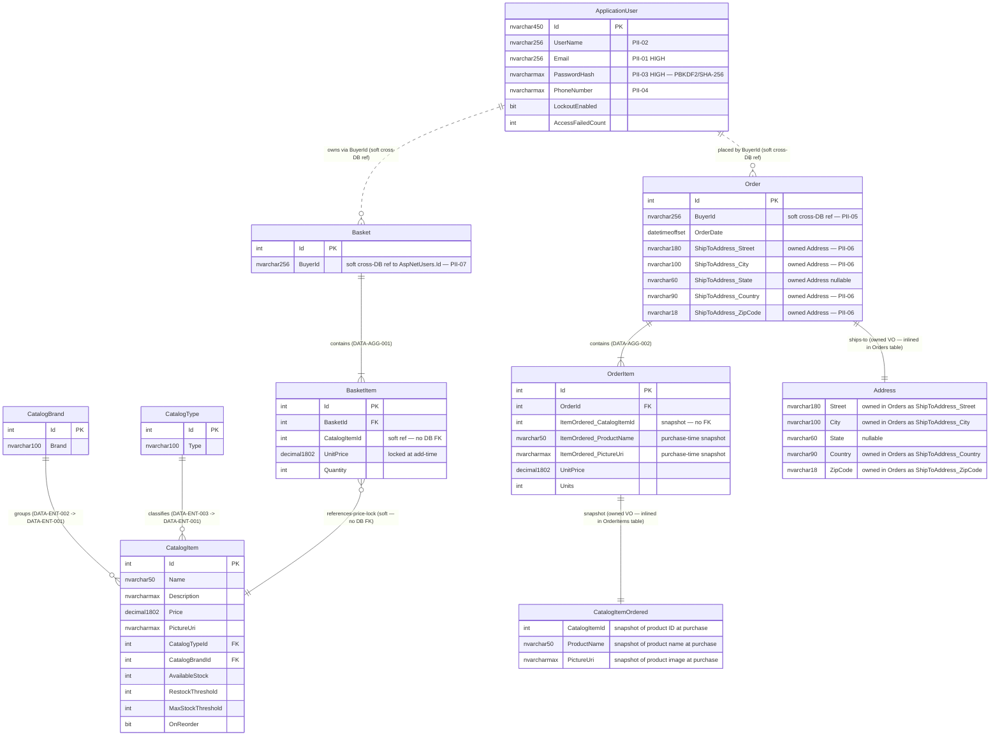
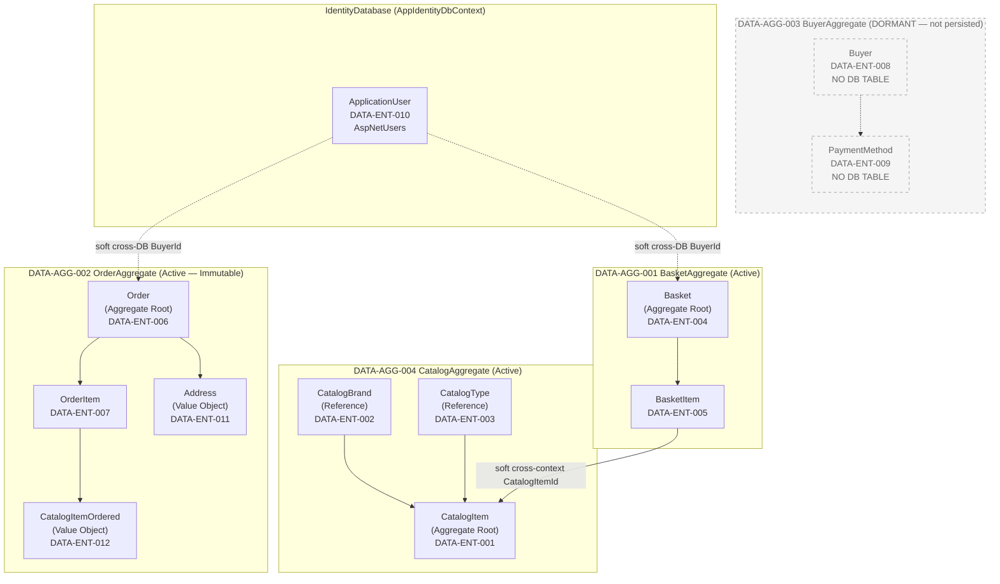
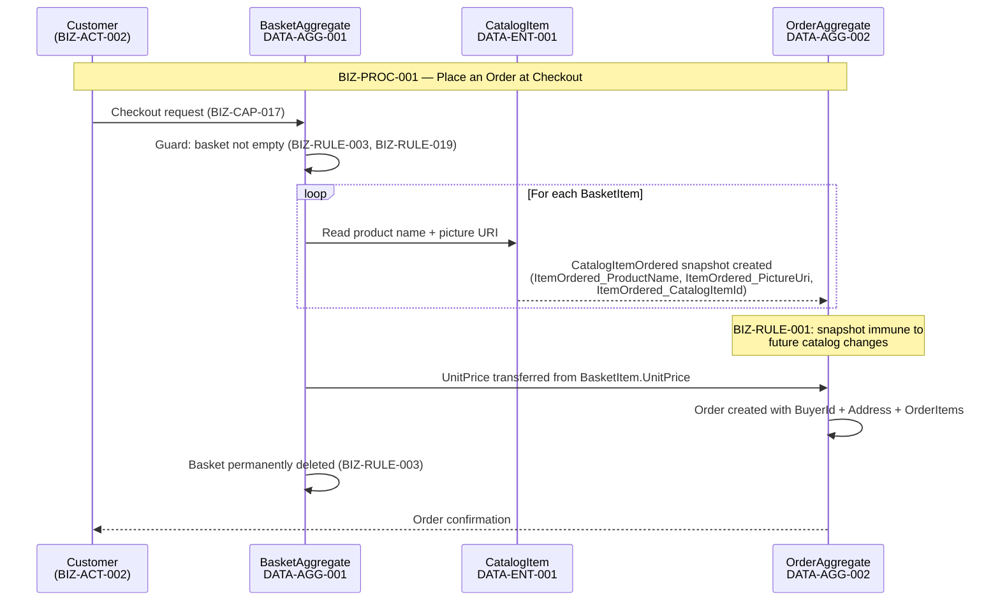
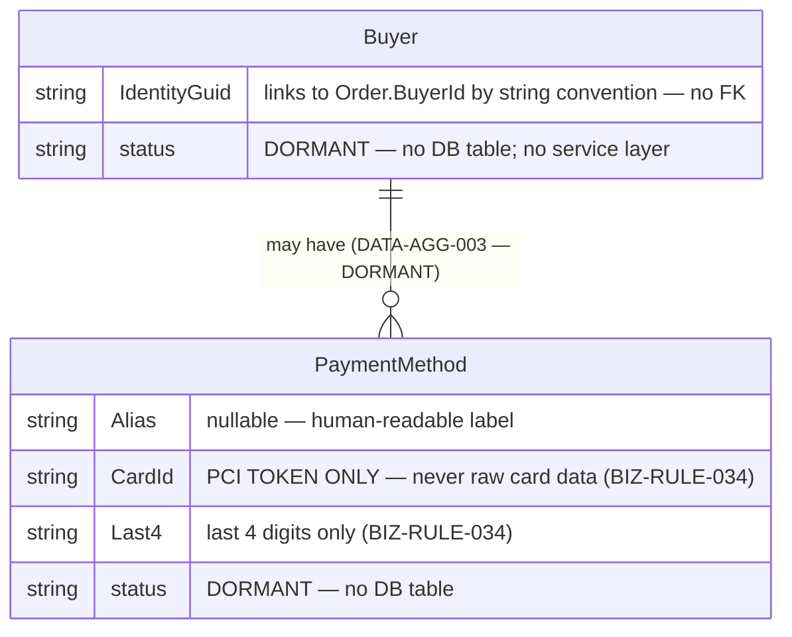
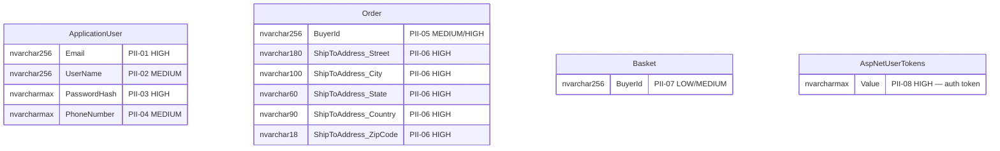

# 08 — Entity Relationship Diagram (ERD)
**eShopOnWeb — Forward Engineering Package**
**Generated:** 2026-06-30
**Pipeline Stage:** Foundation Synthesis Output (Layer 5 — Final)
**Single source of truth:** `ENTERPRISE_KNOWLEDGE_GRAPH.json`
**DA Agent 2 corrections applied:** DISC-002 (column lengths), DISC-003 (Buyer/PaymentMethod DORMANT), DISC-010 (HiLo sequences)

---

## 1. Scope and Conventions

This ERD covers all 13 `DATA-ENT` nodes from the eShopOnWeb Enterprise Knowledge Graph.

**Persisted entities (11):** CatalogItem, CatalogBrand, CatalogType, Basket, BasketItem, Order, OrderItem, ApplicationUser — plus owned value objects Address (inlined in Orders) and CatalogItemOrdered (inlined in OrderItems)

**DORMANT entities (2 — shown in separate sub-model):** Buyer (DATA-ENT-008), PaymentMethod (DATA-ENT-009) — confirmed not persisted (DISC-003 / BIZ-RULE-035)

**Abstract base (1 — excluded from diagram):** BaseEntity (DATA-ENT-013) — provides int Id to all entities; no table

**Aggregate boundaries:**
- `DATA-AGG-001` BasketAggregate: root = Basket; children = BasketItem
- `DATA-AGG-002` OrderAggregate: root = Order; children = OrderItem, Address (VO), CatalogItemOrdered (VO)
- `DATA-AGG-003` BuyerAggregate: DORMANT — root = Buyer; children = PaymentMethod
- `DATA-AGG-004` CatalogAggregate (informal): root = CatalogItem; references = CatalogBrand, CatalogType

**Relationship types in diagrams:**
- Solid lines (`--`) = enforced database FK
- Dotted lines (`..`) = soft reference (cross-DB, application-enforced only, NO DB FK)
- `||` = exactly one (mandatory)
- `o{` = zero-or-many
- `|{` = one-or-many

---

## 2. Primary ERD — All 13 Active Entities

### 2.1 Complete Mermaid ERD

---

### 2.2 Cross-Database and Boundary Annotations

| Relationship | From → To | Enforcement | Risk / Note |
|---|---|---|---|
| Basket.BuyerId → AspNetUsers.Id | CatalogDB → IdentityDB | Application code only — NO DB FK | Orphan baskets if user deleted (PII-07); GDPR erasure gap (OQ-002) |
| Order.BuyerId → AspNetUsers.Id | CatalogDB → IdentityDB | Application code only — NO DB FK | Order history preserved post-deletion; may be intentional for financial records (OQ-003) |
| BasketItem.CatalogItemId → Catalog.Id | CatalogDB → CatalogDB | Application code only — NO DB FK | Orphan basket items if catalog item deleted |
| OrderItem.ItemOrdered_CatalogItemId → Catalog.Id | CatalogDB → CatalogDB | NO FK by design | Historical snapshot — intentional per BIZ-RULE-001 |
| Order.ShipToAddress_* | Owned type in Orders | EF owned entity — no separate table | Address columns inlined; PII-06 |
| OrderItem.ItemOrdered_* | Owned type in OrderItems | EF owned entity — no separate table | Snapshot columns inlined; BIZ-RULE-001 |

---

## 3. Aggregate Boundary Diagram

---

## 4. Data Flow Between Aggregates at Checkout

**Price lock chain:**
1. `CatalogItem.Price` → read when item added to basket
2. `BasketItem.UnitPrice` → locked at basket-add time (BIZ-RULE-010)
3. `OrderItem.UnitPrice` → copied from BasketItem.UnitPrice at checkout
4. Future `CatalogItem.Price` changes → have NO effect on existing basket items or orders

---

## 5. Dormant Sub-Model — BuyerAggregate

> **DORMANT / NOT PERSISTED (DISC-003 / BIZ-RULE-035)**
> Buyer (DATA-ENT-008) and PaymentMethod (DATA-ENT-009) have no DbSet registration in CatalogContext.
> No service layer creates or queries them. Documented here for future payment integration planning (AO-05).

**PCI Note (BIZ-RULE-034):** When PaymentMethod is eventually activated (AO-05), `CardId` must store ONLY a PCI-compliant payment processor token (e.g. Stripe token). Raw card numbers, CVV, expiry dates, or full PANs must NEVER be stored. The existing source code contains an explicit comment referencing Stripe as the intended processor.

**Payment processor decision required (OQ-008):** Stripe vs Braintree vs other — unresolved. PaymentMethod.CardId token format depends on this choice.

---

## 6. Relationship Inventory

All relationships from the Enterprise Knowledge Graph:

| Relationship | From Entity | To Entity | Cardinality | FK / Mechanism | Status |
|---|---|---|---|---|---|
| Data-ENT-001 → CatalogBrand | CatalogItem | CatalogBrand | Many → One | CatalogItem.CatalogBrandId FK → CatalogBrands.Id | Active |
| Data-ENT-001 → CatalogType | CatalogItem | CatalogType | Many → One | CatalogItem.CatalogTypeId FK → CatalogTypes.Id | Active |
| Basket contains BasketItem | Basket | BasketItem | One → Many | BasketItem.BasketId FK → Baskets.Id (CASCADE) | Active |
| BasketItem references CatalogItem | BasketItem | CatalogItem | Many → One | Soft ref — NO DB FK | Active |
| Order contains OrderItem | Order | OrderItem | One → Many | OrderItem.OrderId FK → Orders.Id (CASCADE) | Active |
| OrderItem owns CatalogItemOrdered | OrderItem | CatalogItemOrdered | One → One | Owned type (ItemOrdered_*) — snapshot, NO FK | Active |
| Order ships to Address | Order | Address | One → One | Owned type (ShipToAddress_*) — inlined | Active |
| Basket owned by ApplicationUser | Basket | ApplicationUser | Many → One | Basket.BuyerId soft cross-DB — NO FK | Active |
| Order placed by ApplicationUser | Order | ApplicationUser | Many → One | Order.BuyerId soft cross-DB — NO FK | Active |
| Basket converts to Order | Basket | Order | One → One | Process-level at checkout; basket deleted after (BIZ-RULE-003) | Active |
| Buyer owns PaymentMethod | Buyer | PaymentMethod | One → Many | NO FK — DORMANT (DATA-AGG-003) | DORMANT |

---

## 7. Entity-to-Table Mapping

| Entity (DATA-ENT) | Table | Database | Key Type | Aggregate |
|---|---|---|---|---|
| DATA-ENT-001 CatalogItem | Catalog | CatalogDatabase | HiLo `catalog_hilo` | DATA-AGG-004 (root) |
| DATA-ENT-002 CatalogBrand | CatalogBrands | CatalogDatabase | HiLo `catalog_brand_hilo` | DATA-AGG-004 (reference) |
| DATA-ENT-003 CatalogType | CatalogTypes | CatalogDatabase | HiLo `catalog_type_hilo` | DATA-AGG-004 (reference) |
| DATA-ENT-004 Basket | Baskets | CatalogDatabase | IDENTITY | DATA-AGG-001 (root) |
| DATA-ENT-005 BasketItem | BasketItems | CatalogDatabase | IDENTITY | DATA-AGG-001 (member) |
| DATA-ENT-006 Order | Orders | CatalogDatabase | IDENTITY | DATA-AGG-002 (root) |
| DATA-ENT-007 OrderItem | OrderItems | CatalogDatabase | IDENTITY | DATA-AGG-002 (member) |
| DATA-ENT-008 Buyer | NONE — not persisted | — | — | DATA-AGG-003 (DORMANT) |
| DATA-ENT-009 PaymentMethod | NONE — not persisted | — | — | DATA-AGG-003 (DORMANT) |
| DATA-ENT-010 ApplicationUser | AspNetUsers | IdentityDatabase | GUID string | Identity (standalone) |
| DATA-ENT-011 Address | Orders (inlined ShipToAddress_*) | CatalogDatabase | Owned VO — no PK | DATA-AGG-002 (VO) |
| DATA-ENT-012 CatalogItemOrdered | OrderItems (inlined ItemOrdered_*) | CatalogDatabase | Owned VO — no PK | DATA-AGG-002 (VO) |
| DATA-ENT-013 BaseEntity | NONE — abstract | — | — | Shared kernel |

---

## 8. PII Overlay

Entities and columns containing PII data, from DA:pii-inventory.json:

**GDPR considerations:**
- Right to erasure applies to all HIGH sensitivity PII fields
- Cross-DB soft references (BuyerId) mean user deletion does NOT cascade to orders or baskets
- Order records likely retained for financial/legal reasons even after user deletion (OQ-003)
- No GDPR erasure workflow found in codebase — significant compliance gap (OQ-002 / ASMP-002)

---

*ERD — all 13 entities from ENTERPRISE_KNOWLEDGE_GRAPH.json.*
*DA Agent 2 confirmed field types and key strategies applied.*
*Dormant BuyerAggregate documented separately — not part of current schema.*
