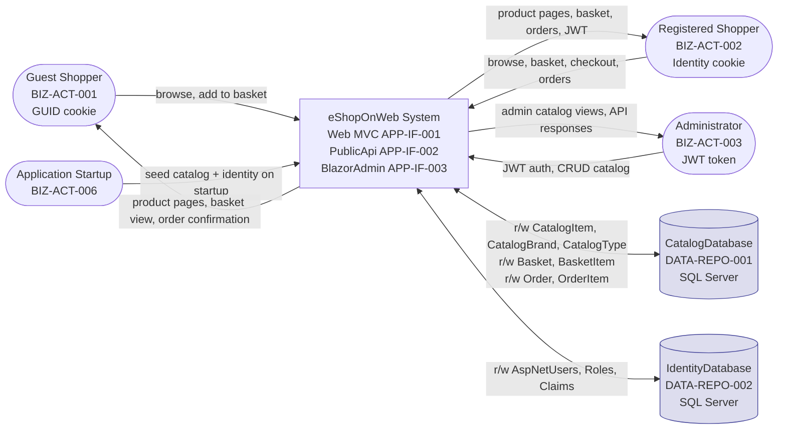
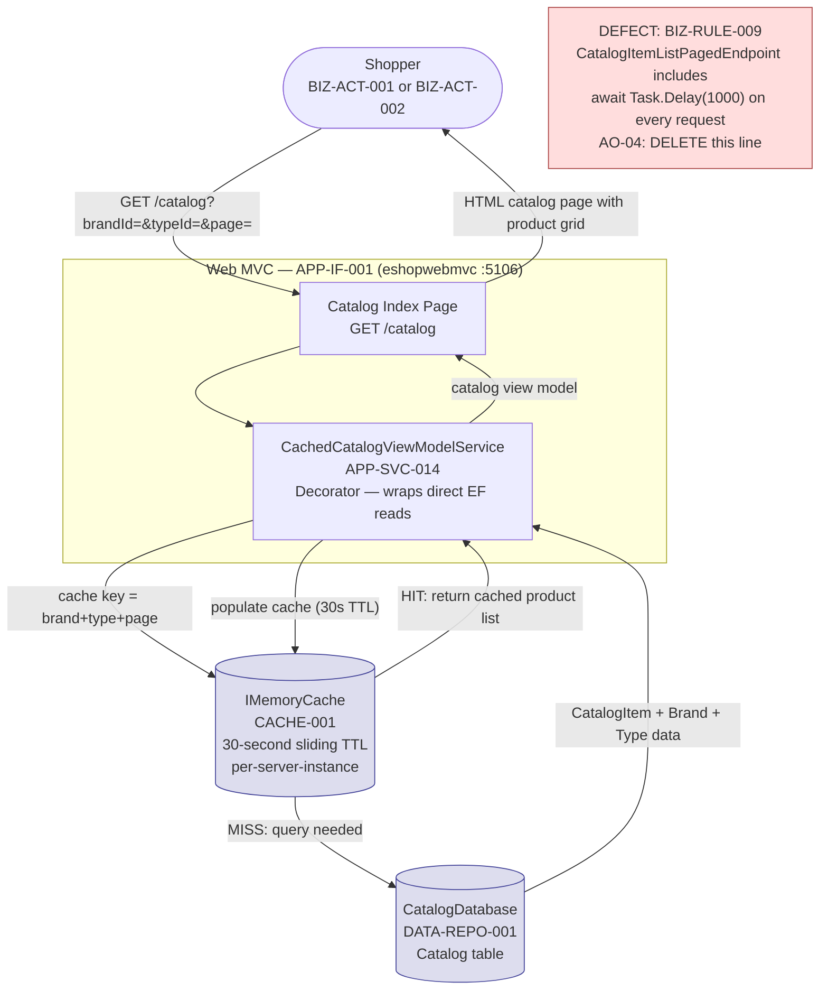
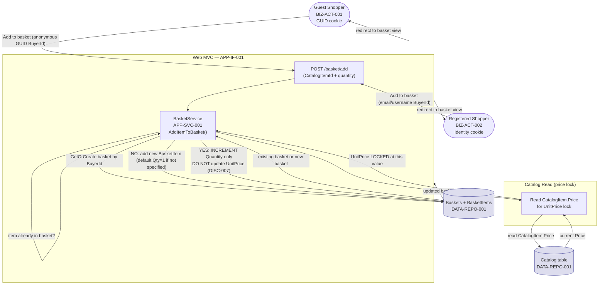
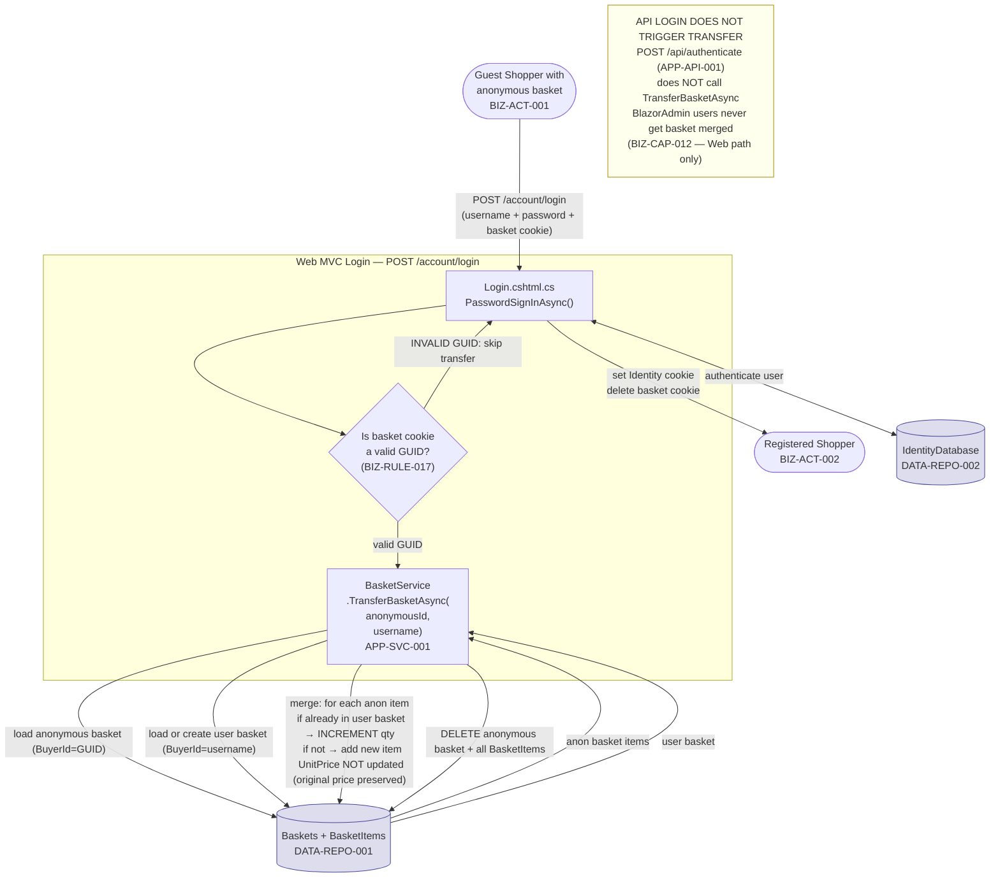
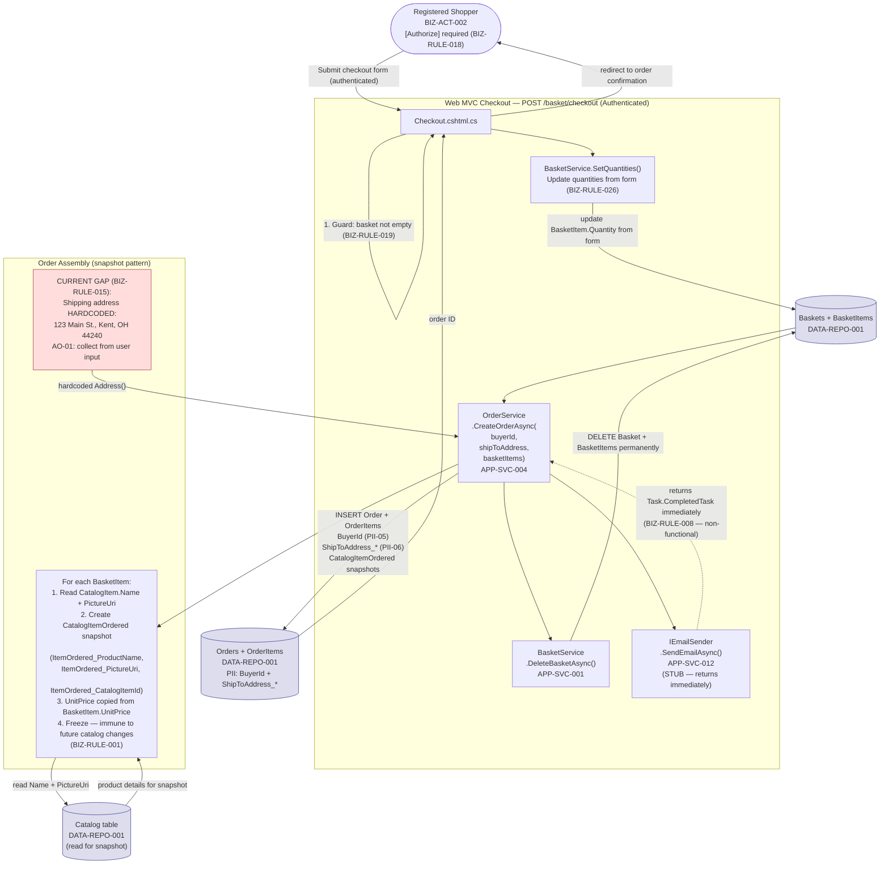
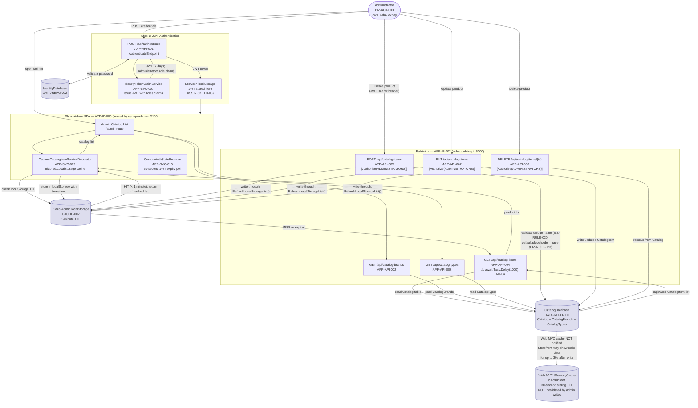
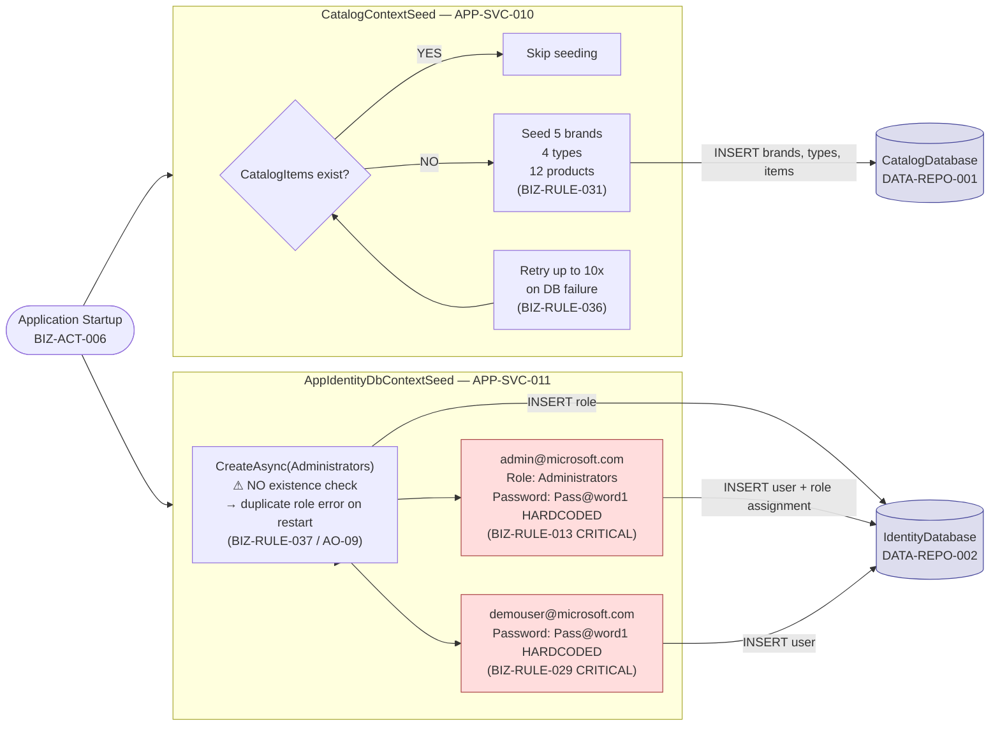

# 09 — Data Flow Diagram (DFD)
**eShopOnWeb — Forward Engineering Package**
**Generated:** 2026-06-30
**Pipeline Stage:** Foundation Synthesis Output (Layer 5 — Final)
**Single source of truth:** `ENTERPRISE_KNOWLEDGE_GRAPH.json`
**Actors:** BIZ-ACT-001 through BIZ-ACT-006 | **Processes:** BIZ-PROC-001 through BIZ-PROC-007

---

## 1. Purpose, Scope, and Notation

### 1.1 Purpose

This Data Flow Diagram models how data moves between external actors, system processes, and data stores across four primary business flows in eShopOnWeb. It establishes:

- Where data **originates** (sources), where it **rests** (stores), who **consumes** it (sinks)
- Which data is **PII-bearing** and where it crosses trust boundaries
- How the two independent caching layers interact with the primary data stores
- Cross-domain handoffs and the snapshot pattern at checkout

### 1.2 Primary Flows Covered

| Flow | Process ID | Value Stream |
|---|---|---|
| Browse Catalog (public storefront) | BIZ-PROC-003 | VS-001 Stage 2 |
| Add to Basket | BIZ-PROC-003 | VS-001 Stage 3 |
| Checkout — Place an Order | BIZ-PROC-001 | VS-001 Stage 5 |
| Admin Catalog Management | BIZ-PROC-005 | VS-002 |

### 1.3 Actors

| Actor ID | Name | Auth Mechanism |
|---|---|---|
| BIZ-ACT-001 | Guest Shopper (Anonymous) | 10-year essential GUID cookie (BIZ-RULE-016) |
| BIZ-ACT-002 | Registered Shopper | ASP.NET Identity cookie (Web) or JWT (API) |
| BIZ-ACT-003 | Product Administrator | JWT token (7-day expiry; BIZ-RULE-024) |
| BIZ-ACT-004 | Demo Shopper (demouser@microsoft.com) | Seeded account — hardcoded password (BIZ-RULE-029 CRITICAL) |
| BIZ-ACT-005 | Seeded Administrator (admin@microsoft.com) | Seeded account — hardcoded password (BIZ-RULE-013 CRITICAL) |
| BIZ-ACT-006 | Application Startup Process (System) | Internal; runs CatalogContextSeed + AppIdentityDbContextSeed |

### 1.4 Data Stores

| Store ID | Name | Technology | Context |
|---|---|---|---|
| DATA-REPO-001 | CatalogDatabase | SQL Server via CatalogContext EF | Catalog, Basket, Order tables |
| DATA-REPO-002 | IdentityDatabase | SQL Server via AppIdentityDbContext | AspNetUsers, Roles |
| CACHE-001 | Web MVC IMemoryCache | ASP.NET Core IMemoryCache (server-side, in-process) | 30s sliding TTL; per Web server instance |
| CACHE-002 | BlazorAdmin localStorage | Blazored.LocalStorage (browser client-side) | 1-minute TTL; per browser session |

---

## 2. Context Diagram (Level 0)

The system as a single process box — all actors and all data stores.



**Architecture note:** Two SQL Server databases share one physical container (`TECH-INF-003`). CatalogDatabase holds Catalog + Basket + Order entities. IdentityDatabase holds the full ASP.NET Core Identity schema. Both connected via separate EF Core contexts with separate connection strings.

---

## 3. Flow 1 — Browse Catalog (VS-001 Stage 2)

**Capabilities:** BIZ-CAP-001 (Paged Browse), BIZ-CAP-002 (Single Product), BIZ-CAP-006 (Brands), BIZ-CAP-007 (Types)
**Services:** APP-SVC-014 (CachedCatalogViewModelService), APP-SVC-008 (EfRepository)
**Cache:** CACHE-001 (IMemoryCache, 30s sliding TTL)



**Cache gap (DISC-006):** DA Agent 1 missed this cache layer entirely. CachedCatalogViewModelService (APP-SVC-014) wraps ALL Web MVC catalog reads with 30-second IMemoryCache. The 30-second window means the storefront may show stale catalog data for up to 30 seconds after any admin write — the admin's BlazorAdmin localStorage cache does NOT invalidate this server-side cache.

**Performance defect (BIZ-RULE-009 — CRITICAL):** `CatalogItemListPagedEndpoint.cs:42` contains `await Task.Delay(1000)` — a mandatory 1-second artificial delay on EVERY catalog browse request. This is a known production blocker. AO-04 fix: delete this one line.

---

## 4. Flow 2 — Add to Basket (BIZ-PROC-003)

**Capabilities:** BIZ-CAP-010 (Add Item), BIZ-CAP-013 (Update Quantity), BIZ-CAP-016 (Get/Create Basket)
**Service:** APP-SVC-001 (BasketService)
**Rules:** BIZ-RULE-004 (default qty 1), DISC-007 (auto-merge on duplicate), BIZ-RULE-016 (essential GUID cookie)



**Price lock (BIZ-RULE-010):** BasketItem.UnitPrice is frozen when the item is first added. If the same item is already in the basket, its UnitPrice does NOT update — only Quantity increments. This means the basket may show a different price than the current catalog price if catalog prices change between add and checkout.

**Anonymous basket (BIZ-RULE-016):** Guest shoppers have a 10-year essential GUID cookie (`BuyerId = GUID string`). This cookie is marked as "essential" and is NOT subject to consent banners.

**BuyerId ambiguity (OQ-001 / ASMP-001):** Unit test evidence (`TransferBasket.cs` uses `testuser@microsoft.com`) suggests BuyerId stores the user's email address, not their AspNetUsers.Id GUID. If confirmed, PII-05 and PII-07 must be elevated to HIGH sensitivity.

---

## 5. Flow 3 — Anonymous-to-User Basket Transfer (BIZ-PROC-004)

**Capability:** BIZ-CAP-012 (Basket Transfer)
**Service:** APP-SVC-001 (BasketService.TransferBasketAsync)
**CRITICAL:** This flow triggers ONLY on Web login (Login.cshtml.cs:83-114) — NOT on API login (AuthenticateEndpoint)



---

## 6. Flow 4 — Checkout / Place an Order (BIZ-PROC-001)

**Capabilities:** BIZ-CAP-017 (Order Creation), BIZ-CAP-018 (Order Total)
**Services:** APP-SVC-004 (OrderService.CreateOrderAsync), APP-SVC-001 (BasketService.DeleteBasketAsync)
**Rules:** BIZ-RULE-001 (snapshot), BIZ-RULE-003 (delete basket), BIZ-RULE-006 (auth required), BIZ-RULE-018 (checkout requires auth)
**PII flows:** BuyerId (PII-05), ShipToAddress_* (PII-06)



**PII data at checkout:**
- `Order.BuyerId` (PII-05): user's identity reference — MEDIUM sensitivity (HIGH if email per OQ-001)
- `Order.ShipToAddress_*` (PII-06): full physical shipping address — HIGH sensitivity; right to erasure applies

**Non-functional email (BIZ-RULE-008 — CRITICAL):** `EmailSender.SendEmailAsync()` in `EmailSender.cs` returns `Task.CompletedTask` immediately. No email is ever sent. AO-02 must implement a real email delivery service before production.

**Basket deletion (BIZ-RULE-003):** Basket is permanently deleted after order creation. This action is irreversible. There is no order cancellation or basket restoration path (BIZ-RULE-012: orders immutable).

---

## 7. Flow 5 — Admin Catalog Management (BIZ-PROC-005)

**Capabilities:** BIZ-CAP-003 (Create), BIZ-CAP-004 (Update), BIZ-CAP-005 (Delete), BIZ-CAP-008 (Cached View)
**Services:** APP-SVC-009 (CachedCatalogItemServiceDecorator), APP-SVC-007 (IdentityTokenClaimService)
**Cache:** CACHE-002 (BlazorAdmin localStorage, 1-minute TTL, write-through)
**Auth:** BIZ-RULE-005 (ADMINISTRATORS role required; BIZ-RULE-007 JWT with roles as claims)



**Two independent caches — NOT cross-invalidated:**
- `CACHE-001` (Web MVC IMemoryCache, 30s): wraps storefront catalog reads; server-side, per-instance; admin writes do NOT invalidate this cache
- `CACHE-002` (BlazorAdmin localStorage, 1min): client-side per-browser; write-through for Create/Update/Delete; TTL-only for brands and types

**Cache staleness window:** An admin deletes a product at time T. Storefront shoppers may see that product for up to 30 seconds (CACHE-001 TTL) after deletion.

**XSS risk (TD-03):** JWT token is stored in browser localStorage. Any XSS attack on the BlazorAdmin page can exfiltrate the admin JWT token, which has a 7-day validity. AO-03 recommendation: migrate to httpOnly cookie for JWT storage.

**Architecture violation (ARCH-VIOL-001 through ARCH-VIOL-007):** Six PublicApi endpoints (CatalogBrandListEndpoint, CatalogItemGetByIdEndpoint, CreateCatalogItemEndpoint, DeleteCatalogItemEndpoint, UpdateCatalogItemEndpoint, CatalogTypeListEndpoint) inject EfRepository directly, bypassing domain service abstractions. This violates Clean Architecture. The forward engineering spec (FE-14) corrects this by routing through IRepository<T> interfaces.

---

## 8. PII Data Flow Map

Summary of all flows involving PII data, with sensitivity levels:

| PII ID | Field | Flow | Actor | Sensitivity | GDPR Note |
|---|---|---|---|---|---|
| PII-01 | AspNetUsers.Email | Registration, login, JWT claims | BIZ-ACT-002 | HIGH | Right to erasure applies |
| PII-02 | AspNetUsers.UserName | Login, basket transfer | BIZ-ACT-002 | MEDIUM | Likely = Email (ASMP-001) |
| PII-03 | AspNetUsers.PasswordHash | Login validation | BIZ-ACT-002 | HIGH | Never log; PBKDF2/SHA-256 |
| PII-04 | AspNetUsers.PhoneNumber | Account management | BIZ-ACT-002 | MEDIUM | Optional; erasure if populated |
| PII-05 | Orders.BuyerId | Checkout (Flow 4), order history | BIZ-ACT-002 | MEDIUM/HIGH | Cross-DB soft ref; post-deletion retention |
| PII-06 | Orders.ShipToAddress_* | Checkout (Flow 4) | BIZ-ACT-002 | HIGH | Full physical address; right to erasure |
| PII-07 | Baskets.BuyerId | Add to basket (Flow 2) | BIZ-ACT-001/002 | LOW/MEDIUM | Orphan risk on user deletion |
| PII-08 | AspNetUserTokens.Value | JWT token storage | BIZ-ACT-003 | HIGH | Auth token; right to erasure |

**PII in transit — checkout flow (BIZ-RULE-015 CRITICAL):** Current source code hardcodes shipping address "123 Main St., Kent, OH, United States, 44240" in `Checkout.cshtml.cs:57`. Real user PII (ShipToAddress_*) is never actually collected or stored in the current implementation. AO-01 must be implemented to collect real shipping addresses — at which point PII-06 flows become active and require full GDPR treatment.

---

## 9. Startup Flow (BIZ-PROC-007)

**Services:** APP-SVC-010 (CatalogContextSeed), APP-SVC-011 (AppIdentityDbContextSeed)
**Rules:** BIZ-RULE-036 (10 retry attempts), BIZ-RULE-037 (idempotency bug on role creation)



**AO-09 fix for BIZ-RULE-037:** Change identity seeding to:
```csharp
if (!await roleManager.RoleExistsAsync(AuthorizationConstants.Roles.ADMINISTRATORS))
    await roleManager.CreateAsync(new IdentityRole(AuthorizationConstants.Roles.ADMINISTRATORS));
```

---

*Data Flow Diagram — 5 primary business flows from ENTERPRISE_KNOWLEDGE_GRAPH.json.*
*All actor, service, and data store IDs traceable to EKG node IDs.*
*PII data flows highlighted with sensitivity levels PII-01 through PII-08.*
