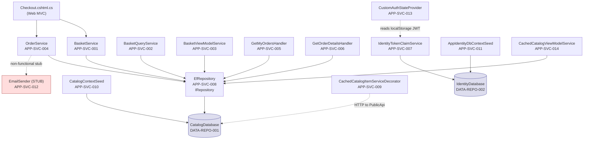

# 10 — Service Catalog
**eShopOnWeb — Forward Engineering Package**
**Generated:** 2026-06-30
**Pipeline Stage:** Foundation Synthesis Output (Layer 5 — Final)
**Single source of truth:** `ENTERPRISE_KNOWLEDGE_GRAPH.json`
**Coverage:** All 14 application services (APP-SVC-001 through APP-SVC-014) + 2 repository services + 2 cache layers

---

## 1. Service Inventory Overview

The Enterprise Knowledge Graph (foundation layer) identifies 14 named application services for eShopOnWeb, organized across 5 functional domains:

| Domain | Services | Count |
|---|---|---|
| Basket | BasketService, BasketQueryService, BasketViewModelService | 3 |
| Order | OrderService, GetMyOrdersHandler, GetOrderDetailsHandler | 3 |
| Catalog | CachedCatalogItemServiceDecorator, CachedCatalogViewModelService | 2 |
| Identity | IdentityTokenClaimService, CustomAuthStateProvider | 2 |
| Infrastructure | EfRepository, CatalogContextSeed, AppIdentityDbContextSeed, EmailSender | 4 |

**Additionally documented:**
- Repository services: DATA-REPO-001 (CatalogDatabase), DATA-REPO-002 (IdentityDatabase)
- Cache layers: CACHE-001 (IMemoryCache), CACHE-002 (localStorage)

---

## 2. Service Specification Format

Each service entry includes:
- **ID:** APP-SVC-### node ID from the Enterprise Knowledge Graph
- **Responsibility:** What the service does (one paragraph)
- **Interface:** .NET interface the service implements or contracts it fulfills
- **Key methods:** Primary operations
- **Dependencies:** Services and repositories this service depends on
- **Consumers:** Services and components that call this service
- **Domain/module:** Owning bounded context
- **Source path:** Project file location
- **Capabilities served:** BIZ-CAP-### node IDs
- **Architecture notes:** Violations, gaps, or production blockers

---

## 3. Basket Domain Services

### APP-SVC-001 — BasketService
**Responsibility:** Manages the complete lifecycle of the shopping basket aggregate (DATA-AGG-001). Implements all mutating basket operations: adding items with price-locking, updating quantities, merging anonymous baskets into authenticated user baskets on login, and permanently deleting baskets after checkout. The service enforces that adding a duplicate catalog item auto-merges by incrementing quantity rather than creating a duplicate line (DISC-007 / BIZ-RULE-004), and that the price is always locked at the time of the FIRST add.

**Interface:** `IBasketService`

**Key methods:**
| Method | Signature | Rule |
|---|---|---|
| AddItemToBasket | `Task AddItemToBasket(int basketId, int catalogItemId, decimal price, int quantity = 1)` | BIZ-RULE-004: default qty 1; DISC-007: auto-merge |
| DeleteBasketAsync | `Task DeleteBasketAsync(string basketId)` | BIZ-RULE-003: permanent deletion |
| TransferBasketAsync | `Task TransferBasketAsync(string anonymousId, string userName)` | BIZ-RULE-002: Web login only; BIZ-RULE-017: GUID validation |
| SetQuantities | `Task<Basket> SetQuantities(int basketId, Dictionary<string, int> quantities)` | BIZ-RULE-026: called before order creation |

**Dependencies:**
- `IRepository<Basket>` (EfRepository — via interface)
- `IAppLogger<BasketService>`

**Consumers:**
- `Checkout.cshtml.cs` — SetQuantities then triggers order creation
- `Login.cshtml.cs` — TransferBasketAsync on Web login (lines 83-114)
- `BasketController` — AddItemToBasket, UpdateQuantities

**Domain:** Basket | **Source:** `src/ApplicationCore/Services/BasketService.cs`
**Capabilities:** BIZ-CAP-010, BIZ-CAP-011, BIZ-CAP-012, BIZ-CAP-013

**Architecture note:** TransferBasketAsync is called ONLY from `Login.cshtml.cs` (Web MVC login). `AuthenticateEndpoint` (API login / POST /api/authenticate) does NOT call this method. BlazorAdmin users authenticating via the API never have their anonymous basket merged (BIZ-CAP-012).

---

### APP-SVC-002 — BasketQueryService
**Responsibility:** Provides a lightweight read-only query for the basket item count displayed in the navigation header. Separated from BasketService to allow the header component to query basket count without loading full basket details.

**Interface:** `IBasketQueryService`

**Key methods:**
| Method | Signature | Purpose |
|---|---|---|
| CountTotalBasketItems | `Task<int> CountTotalBasketItems(string userName)` | Returns total item count for nav header |

**Dependencies:**
- `IReadRepository<Basket>` (read-only EF repository — via interface)

**Consumers:**
- Navigation header view component (Web MVC)

**Domain:** Basket | **Source:** `src/ApplicationCore/Services/BasketQueryService.cs`
**Capabilities:** BIZ-CAP-014

---

### APP-SVC-003 — BasketViewModelService
**Responsibility:** Assembles the basket view model for display on the basket page. Loads the basket aggregate and joins with live CatalogItem data to show current product names, images, and prices. Also implements the "get or create basket" pattern — if no basket exists for the current user, creates one.

**Interface:** `IBasketViewModelService`

**Key methods:**
| Method | Signature | Purpose |
|---|---|---|
| GetOrCreateBasketForUser | `Task<BasketViewModel> GetOrCreateBasketForUser(string userName)` | BIZ-CAP-016 |
| Map | `Task<BasketViewModel> Map(Basket basket)` | Enriches basket with catalog item details |

**Dependencies:**
- `IRepository<Basket>` (via interface)
- `IReadRepository<CatalogItem>` (via interface, for name/image enrichment)
- AutoMapper (`TECH-CUR-011`)

**Consumers:**
- `Basket/Index.cshtml.cs` — basket page

**Domain:** Basket (Web layer) | **Source:** `src/Web/Services/BasketViewModelService.cs`
**Capabilities:** BIZ-CAP-015, BIZ-CAP-016

---

## 4. Order Domain Services

### APP-SVC-004 — OrderService
**Responsibility:** Creates confirmed orders from basket contents. For each basket item, reads the current CatalogItem to capture a point-in-time snapshot (CatalogItemOrdered value object — name, picture URI, catalog item ID) plus the basket item's already-locked unit price. Assembles the Order aggregate with all OrderItems, persists it, and does NOT delete the basket (basket deletion is done by the caller). Order total is calculated as a domain method (Order.Total() = sum of UnitPrice × Units) — no stored total column exists.

**Interface:** `IOrderService`

**Key methods:**
| Method | Signature | Rules |
|---|---|---|
| CreateOrderAsync | `Task CreateOrderAsync(int basketId, Address shippingAddress)` | BIZ-RULE-001 (snapshot), BIZ-RULE-003, BIZ-RULE-015 |

**Dependencies:**
- `IRepository<Order>` (via interface)
- `IRepository<Basket>` (via interface — to read basket items)
- `IReadRepository<CatalogItem>` (via interface — for snapshot)

**Consumers:**
- `Checkout.cshtml.cs` — after SetQuantities

**Domain:** Order | **Source:** `src/ApplicationCore/Services/OrderService.cs`
**Capabilities:** BIZ-CAP-017, BIZ-CAP-018

**CRITICAL GAP (BIZ-RULE-015 / AO-01):** Current implementation (`Checkout.cshtml.cs:57`) passes a hardcoded `new Address("123 Main St.", "Kent", "OH", "United States", "44240")` to `CreateOrderAsync`. The method signature accepts `Address` as a parameter — the fix is entirely in `Checkout.cshtml.cs`, which must collect the address from user input and pass it through. The forward engineering implementation MUST NOT replicate the hardcoded address.

**Immutability (BIZ-RULE-012):** No update, cancel, or status-change method exists on OrderService. Orders are append-only. No order status field exists on the Order entity.

---

### APP-SVC-005 — GetMyOrdersHandler
**Responsibility:** MediatR query handler that returns a list of all orders belonging to the currently authenticated user (identified by BuyerId). Enforces per-owner access — only returns orders where Order.BuyerId matches the requesting user. Returns empty list (not 404) if the user has no orders.

**Interface:** `IRequestHandler<GetMyOrdersQuery, IEnumerable<OrderViewModel>>` (MediatR)

**Key methods:**
| Method | Signature | Rules |
|---|---|---|
| Handle | `Task<IEnumerable<OrderViewModel>> Handle(GetMyOrdersQuery request, CancellationToken ct)` | BIZ-RULE-030 |

**Dependencies:**
- `IReadRepository<Order>` (via interface + Ardalis.Specification)
- AutoMapper

**Consumers:**
- `OrderController.MyOrders()` — dispatches via `IMediator.Send`

**Domain:** Order (Web layer) | **Source:** `src/Web/Features/MyOrders/GetMyOrdersHandler.cs`
**Capabilities:** BIZ-CAP-019
**Technology:** MediatR (TECH-CUR-010) — used in Web layer only, NOT in PublicApi

---

### APP-SVC-006 — GetOrderDetailsHandler
**Responsibility:** MediatR query handler that returns the full detail of a single order for the authenticated user. Enforces strict per-owner access — if the requested orderId belongs to a different user, returns null (caller maps to HTTP 404). This prevents cross-account order snooping (BIZ-RULE-030).

**Interface:** `IRequestHandler<GetOrderDetailsQuery, OrderViewModel>` (MediatR)

**Key methods:**
| Method | Signature | Rules |
|---|---|---|
| Handle | `Task<OrderViewModel?> Handle(GetOrderDetailsQuery request, CancellationToken ct)` | BIZ-RULE-030: returns null if not owner |

**Dependencies:**
- `IReadRepository<Order>` (via interface + Ardalis.Specification)
- AutoMapper

**Consumers:**
- `OrderController.Detail(orderId)` — dispatches via `IMediator.Send`

**Domain:** Order (Web layer) | **Source:** `src/Web/Features/OrderDetails/GetOrderDetailsHandler.cs`
**Capabilities:** BIZ-CAP-020

---

## 5. Identity Domain Services

### APP-SVC-007 — IdentityTokenClaimService
**Responsibility:** Issues JWT tokens for the PublicApi authentication flow. Reads the authenticated user's identity from ASP.NET Core Identity (UserManager), retrieves all assigned roles as claims, and constructs a signed JWT token. Token carries the user name and all role names as claims, valid for 7 days from issuance.

**Interface:** `ITokenClaimService`

**Key methods:**
| Method | Signature | Rules |
|---|---|---|
| GetTokenAsync | `Task<string> GetTokenAsync(string userName)` | BIZ-RULE-007, BIZ-RULE-024 (7-day expiry) |

**Dependencies:**
- `UserManager<ApplicationUser>` (ASP.NET Core Identity)
- JWT configuration (`IConfiguration["Auth:JwtKey"]` — AO-03: must NOT be from hardcoded constant)

**Consumers:**
- `AuthenticateEndpoint` (APP-API-001) — called after password validation

**Domain:** Identity | **Source:** `src/Infrastructure/Identity/IdentityTokenClaimService.cs`
**Capabilities:** BIZ-CAP-023

**CRITICAL SECURITY GAP (BIZ-RULE-032 / AO-03):** Current source code (`AuthorizationConstants.cs:12`) hardcodes the JWT signing key as `"SecretKeyOfDoomThatMustBeAMinimumNumberOfBytes"` with an explicit TODO comment warning against production use. Anyone with repo access can forge valid JWT tokens for any user. The forward engineering implementation MUST read the key from `IConfiguration["Auth:JwtKey"]` sourced from environment variables or Azure Key Vault — NEVER from a hardcoded constant.

---

### APP-SVC-013 — CustomAuthStateProvider
**Responsibility:** Provides authentication state for the BlazorAdmin SPA. Reads the JWT token from browser localStorage, parses the claims to determine if the user is authenticated and their role assignments, and exposes the authentication state to the Blazor component tree. Polls for JWT expiry every 60 seconds to detect token expiration without requiring a page reload.

**Interface:** `AuthenticationStateProvider` (Blazor framework base class)

**Key methods:**
| Method | Purpose |
|---|---|
| GetAuthenticationStateAsync | Returns current auth state from localStorage JWT |
| MarkUserAsAuthenticated | Called after successful JWT receipt |
| MarkUserAsLoggedOut | Clears JWT from localStorage |

**Dependencies:**
- `Blazored.LocalStorage.ILocalStorageService` (TECH-CUR-012)
- JWT parsing (client-side claims extraction)

**Consumers:**
- Blazor component tree (framework wires automatically)
- BlazorAdmin components requiring auth checks

**Domain:** Identity (BlazorAdmin) | **Source:** `src/BlazorAdmin/CustomAuthStateProvider.cs`
**Capabilities:** BIZ-CAP-025

**Security risk (TD-03):** JWT stored in localStorage is accessible to any JavaScript running on the page — including XSS attacks. An attacker who injects JavaScript can exfiltrate the admin JWT (7-day validity). Mitigation: migrate to httpOnly cookie for JWT storage (high effort).

---

## 6. Catalog Domain Services

### APP-SVC-009 — CachedCatalogItemServiceDecorator
**Responsibility:** Decorator wrapping catalog item service calls in the BlazorAdmin SPA with a browser localStorage cache. On read, checks if a cached list exists and was created within the last 1 minute; if so, returns the cached data without an HTTP call. On cache miss (or after TTL expiry), fetches from PublicApi and stores in localStorage. On Create/Update/Delete operations, executes the actual API call AND immediately calls `RefreshLocalStorageList()` to update the cache (write-through invalidation for items). Brands and types are NOT write-through invalidated — they expire by TTL only.

**Interface:** `ICatalogItemService` (decorator pattern)

**Key methods:**
| Method | Cache behavior | Rules |
|---|---|---|
| GetCatalogItems | Check localStorage TTL; fetch if expired | DISC-004 (browser cache, not server) |
| CreateCatalogItem | POST to API + RefreshLocalStorageList() | BIZ-RULE-010 (write-through) |
| UpdateCatalogItem | PUT to API + RefreshLocalStorageList() | BIZ-RULE-010 |
| DeleteCatalogItem | DELETE to API + RefreshLocalStorageList() | BIZ-RULE-010 |

**Cache TTL:** 1 minute (`DateCreated.AddMinutes(1)`) — DISC-003 corrected from DA Agent 1's "custom in-process cache"
**Cache technology:** `Blazored.LocalStorage` browser localStorage (TECH-CUR-012) — client-side per-browser, NOT server-side memory
**Invalidation:** Write-through for CatalogItems only; TTL-only for CatalogBrands and CatalogTypes (AO-10: gap to address)

**Dependencies:**
- `ICatalogItemService` (decorated inner service — HTTP client to PublicApi)
- `Blazored.LocalStorage.ILocalStorageService`

**Consumers:**
- BlazorAdmin `List.razor` component

**Domain:** Catalog (BlazorAdmin) | **Source:** `src/BlazorAdmin/Services/CachedCatalogItemServiceDecorator.cs`
**Capabilities:** BIZ-CAP-008

**Gap (DISC-004 / AO-10):** Brand and type lists are not write-through invalidated on catalog writes. If an admin adds a new brand and immediately creates a product with that brand, the brand dropdown may show stale data until the 1-minute TTL expires.

---

### APP-SVC-014 — CachedCatalogViewModelService
**Responsibility:** Decorator wrapping the Web MVC catalog browse service with a server-side ASP.NET Core IMemoryCache. Provides the storefront's paged catalog view (products filtered by brand/type) with a 30-second sliding TTL cache. Cache keys encode the brand ID, type ID, and page number. Cache is per-server-process-instance — NOT distributed. Admin writes via the PublicApi do NOT invalidate this cache.

**Interface:** `ICatalogViewModelService` (decorator pattern)

**Key methods:**
| Method | Cache behavior |
|---|---|
| GetCatalogItems | Check IMemoryCache with composite key; populate on miss |

**Cache TTL:** 30 seconds sliding (CACHE-001)
**Cache technology:** `ASP.NET Core IMemoryCache` (server-side in-process)
**Invalidation:** TTL only — NO invalidation on admin writes (BIZ-RULE-010; storefront may show stale catalog for up to 30s)

**Dependencies:**
- `ICatalogViewModelService` (decorated inner service — direct EF Core read)
- `IMemoryCache` (ASP.NET Core DI)
- `CacheHelpers` (cache key constants class)

**Consumers:**
- Catalog Index Razor page (`/catalog`)

**Domain:** Catalog (Web MVC) | **Source:** `src/Web/Services/CachedCatalogViewModelService.cs`
**Capabilities:** BIZ-CAP-001

**DISC-006:** DA Agent 1 missed this cache layer entirely. CachedCatalogViewModelService is a real, active service wrapping all storefront catalog reads. The 30-second IMemoryCache is the reason the storefront may show products for up to 30 seconds after an admin deletes or updates them.

**Scalability gap (TD-12):** IMemoryCache is per-server-instance. Horizontal scaling (multiple eshopwebmvc containers) results in stale-cache divergence — each instance has its own independent 30-second TTL cache. Redis (IDistributedCache) would be required for consistent caching across multiple instances (OQ-007).

---

## 7. Infrastructure Services

### APP-SVC-008 — EfRepository (Generic Repository)
**Responsibility:** Generic EF Core repository providing all CRUD and query operations for domain entities via the `IRepository<T>` and `IReadRepository<T>` interfaces. Implements the Ardalis.Specification pattern — callers pass a `Specification<T>` object to express query predicates, ordering, and includes, keeping query logic out of service classes.

**Interface:** `IRepository<T>` and `IReadRepository<T>` (Ardalis.Specification)

**Key methods:** `AddAsync`, `UpdateAsync`, `DeleteAsync`, `GetByIdAsync`, `ListAsync`, `CountAsync`, `FirstOrDefaultAsync`, `SingleOrDefaultAsync`

**Dependencies:**
- `CatalogContext` (EF Core DbContext)
- Ardalis.Specification.EntityFrameworkCore (TECH-CUR-009)

**Consumers (via interface — IRepository<T>):**
- `BasketService`, `OrderService`, and all domain services (via IRepository<T> interface)
- `CatalogBrandListEndpoint`, `CatalogItemGetByIdEndpoint`, `CreateCatalogItemEndpoint`, `DeleteCatalogItemEndpoint`, `UpdateCatalogItemEndpoint`, `CatalogTypeListEndpoint` — DIRECT injection (ARCH-VIOL-001 through ARCH-VIOL-006 — see below)
- `IndexModel` — DIRECT injection (ARCH-VIOL-007)

**Domain:** DataAccess (Infrastructure) | **Source:** `src/Infrastructure/Data/EfRepository.cs`
**Capabilities:** BIZ-CAP-028

**ARCHITECTURE VIOLATIONS (ARCH-VIOL-001 through ARCH-VIOL-007):** Six PublicApi catalog endpoints and one Web Razor PageModel (`IndexModel`) inject the concrete `EfRepository<T>` directly rather than going through a domain service interface. This bypasses the application layer and couples the API endpoints directly to the data access layer, violating Clean Architecture. Coupling score = 16 (highest in codebase — ARCH-VIOL-009).

**Forward engineering fix (FE-13, FE-14):** All PublicApi endpoints must receive `IRepository<T>` or `IReadRepository<T>` via constructor injection — never the concrete `EfRepository<T>`. The concrete class should be registered and consumed only inside the Infrastructure project.

---

### APP-SVC-010 — CatalogContextSeed
**Responsibility:** Database seed batch job that runs at application startup. Checks whether the Catalog table already has data; if empty, inserts the initial reference data: 5 brands, 4 product types, and 12 catalog items with placeholder image URIs. Retries up to 10 times on transient database failures before aborting startup (BIZ-RULE-036). Designed to be idempotent — skipped entirely if data already exists.

**Interface:** None (startup service, called from `Program.cs`)

**Key methods:**
| Method | Signature |
|---|---|
| SeedAsync | `static Task SeedAsync(CatalogContext catalogContext, ILogger<CatalogContextSeed> logger)` |

**Dependencies:**
- `CatalogContext` (direct — startup concern)
- `ILogger`

**Consumers:**
- Application startup (`Program.cs`)

**Domain:** Infrastructure | **Source:** `src/Infrastructure/Data/CatalogContextSeed.cs`
**Capabilities:** BIZ-CAP-009, BIZ-CAP-029

---

### APP-SVC-011 — AppIdentityDbContextSeed
**Responsibility:** Identity database seed batch job that runs at application startup. Creates the `Administrators` role and seeds two user accounts: `admin@microsoft.com` (with Administrators role) and `demouser@microsoft.com` (standard user). Contains a known bug: does not check if the Administrators role already exists before creating it, causing a duplicate role error on every restart after the first (BIZ-RULE-037).

**Interface:** None (startup service)

**Key methods:**
| Method | Signature |
|---|---|
| SeedAsync | `static Task SeedAsync(UserManager<ApplicationUser> userManager, RoleManager<IdentityRole> roleManager)` |

**Dependencies:**
- `UserManager<ApplicationUser>` (ASP.NET Core Identity)
- `RoleManager<IdentityRole>` (ASP.NET Core Identity)

**Consumers:**
- Application startup (`Program.cs`)

**Domain:** Infrastructure | **Source:** `src/Infrastructure/Identity/AppIdentityDbContextSeed.cs`
**Capabilities:** BIZ-CAP-026, BIZ-CAP-029

**CRITICAL (BIZ-RULE-013 / BIZ-RULE-029):** Both seeded accounts use the hardcoded password `Pass@word1` from `AuthorizationConstants.cs:8`. The source code has an explicit TODO comment: "IMPORTANT: For web apps, enable confirmation and consider two-factor authentication." These credentials MUST NOT be used in any non-local deployment. AO-03 fix: read seed passwords from `IConfiguration["Seeding:AdminPassword"]`.

**Bug (BIZ-RULE-037 / AO-09):** `CreateAsync(new IdentityRole(roleName))` is called without checking `RoleExistsAsync` first. On second startup, this produces an error. Fix:
```csharp
if (!await roleManager.RoleExistsAsync(roleName))
    await roleManager.CreateAsync(new IdentityRole(roleName));
```

---

### APP-SVC-012 — EmailSender (Stub — Non-Functional)
**Responsibility:** Stub implementation of the email sending interface. All methods return `Task.CompletedTask` immediately without delivering any email. This is a known, named production gap — the service exists as a placeholder with no SMTP or email provider integration.

**Interface:** `IEmailSender`

**Key methods:**
| Method | Implementation |
|---|---|
| SendEmailAsync | `return Task.CompletedTask;` — no email sent |

**Dependencies:** None

**Consumers:**
- `OrderService.CreateOrderAsync` — called after order creation (BIZ-PROC-001 Step 6)
- `Register.cshtml.cs` — email confirmation attempt after registration (BIZ-RULE-027)
- `ManageController` — password reset and account management flows

**Domain:** Infrastructure | **Source:** `src/Infrastructure/Services/EmailSender.cs`
**Capabilities:** BIZ-CAP-027

**STATUS: NON-FUNCTIONAL (BIZ-RULE-008 — CRITICAL):** `SendEmailAsync` returns immediately. No email is ever delivered. This means:
- Order confirmation emails are never sent
- Registration confirmation emails silently disappear (BIZ-RULE-027)
- Password reset emails are never sent
AO-02 must implement a real email provider (SendGrid or SMTP) before production deployment.

---

## 8. Repository Services

### DATA-REPO-001 — CatalogDatabase
**Technology:** SQL Server (Azure SQL Edge in Docker — EOL March 2025; LocalDB in dev)
**EF Context:** `CatalogContext` | **Connection key:** `CatalogConnection`
**ID strategy:** HiLo sequences for CatalogItem/Brand/Type; IDENTITY for Basket/Order

| Table | Entity | Domain |
|---|---|---|
| Catalog | CatalogItem (DATA-ENT-001) | Catalog |
| CatalogBrands | CatalogBrand (DATA-ENT-002) | Catalog |
| CatalogTypes | CatalogType (DATA-ENT-003) | Catalog |
| Baskets | Basket (DATA-ENT-004) | Basket |
| BasketItems | BasketItem (DATA-ENT-005) | Basket |
| Orders | Order (DATA-ENT-006) + Address VO | Order |
| OrderItems | OrderItem (DATA-ENT-007) + CatalogItemOrdered VO | Order |

**Infrastructure risk (TECH-INF-003):** Docker container uses `mcr.microsoft.com/azure-sql-edge` with no version pin. Azure SQL Edge reached EOL in March 2025. Replace with `mcr.microsoft.com/mssql/server:2022-latest` and pin to a specific version tag (TD-04, TD-05).

---

### DATA-REPO-002 — IdentityDatabase
**Technology:** SQL Server (same instance, separate database)
**EF Context:** `AppIdentityDbContext` | **Connection key:** `IdentityConnection`
**ID strategy:** Standard ASP.NET Identity (string GUID keys)

| Table | Purpose |
|---|---|
| AspNetUsers | User accounts (PII-01 through PII-04) |
| AspNetRoles | Roles (confirmed: Administrators) |
| AspNetUserRoles | User-role assignments |
| AspNetUserClaims | User claims (JWT source) |
| AspNetRoleClaims | Role claims |
| AspNetUserLogins | External login providers |
| AspNetUserTokens | Auth tokens (PII-08) |

---

## 9. Cache Layer Services

### CACHE-001 — Web MVC IMemoryCache (CatalogViewModelService)
**Technology:** ASP.NET Core `IMemoryCache` (server-side in-process)
**TTL:** 30 seconds sliding
**Scope:** Per-server-process instance (NOT distributed)
**Service:** APP-SVC-014 (CachedCatalogViewModelService)
**Location:** `eshopwebmvc` container process memory

**Cache key pattern:** `{BrandId}-{TypeId}-{PageIndex}`
**Invalidation:** TTL only — write operations via PublicApi/BlazorAdmin do NOT invalidate this cache
**Staleness:** Storefront may show deleted/updated products for up to 30 seconds after admin writes

**Scalability gap (TD-12):** Per-instance cache means multiple eshopwebmvc containers have independent caches. Horizontal scaling will cause stale-cache divergence. Redis (IDistributedCache) is needed for consistent multi-instance caching (OQ-007).

---

### CACHE-002 — BlazorAdmin localStorage (CachedCatalogItemServiceDecorator)
**Technology:** `Blazored.LocalStorage` browser localStorage (client-side)
**TTL:** 1 minute (`DateCreated.AddMinutes(1)`)
**Scope:** Per-browser-session (NOT server-side, NOT shared)
**Service:** APP-SVC-009 (CachedCatalogItemServiceDecorator)
**Location:** Browser localStorage

**Cache key:** `"catalog_items"` (items), implicit for brands/types
**Invalidation:**
- CatalogItems: Write-through on Create/Update/Delete (calls `RefreshLocalStorageList()`)
- CatalogBrands: TTL only (AO-10 gap)
- CatalogTypes: TTL only (AO-10 gap)

**Security note:** JWT token is ALSO stored in localStorage (DISC-004). XSS vulnerability can exfiltrate both the cached catalog data and the admin JWT token (TD-03).

---

## 10. Service Dependency Map



---

## 11. Production-Readiness Notes for Service Layer

| Service | Status | Issue | Fix |
|---|---|---|---|
| APP-SVC-012 EmailSender | NON-FUNCTIONAL | Returns Task.CompletedTask — no email delivery | AO-02: implement real SMTP/SendGrid |
| APP-SVC-007 IdentityTokenClaimService | CRITICAL | JWT key read from hardcoded constant | AO-03: read from IConfiguration/Key Vault |
| APP-SVC-011 AppIdentityDbContextSeed | CRITICAL | Hardcoded passwords; duplicate role bug | AO-03 + AO-09 |
| APP-SVC-004 OrderService | CRITICAL | Hardcoded shipping address in caller | AO-01: collect from user |
| APP-SVC-008 EfRepository | ARCH VIOLATION | Direct injection in 6 API endpoints | FE-13/FE-14: use IRepository<T> interface |
| APP-SVC-014 CachedCatalogViewModelService | SCALABILITY | Per-instance IMemoryCache | TD-12: plan Redis migration |
| APP-SVC-009 CachedCatalogItemServiceDecorator | SECURITY | JWT in localStorage; brands/types not write-through | TD-03 (XSS); AO-10 (cache invalidation) |

---

*Service Catalog — all 14 APP-SVC nodes + 2 repositories + 2 cache layers from ENTERPRISE_KNOWLEDGE_GRAPH.json.*
*Every service, interface, dependency, and consumer traced to EKG node IDs.*
*Production blockers and architecture violations explicitly flagged with roadmap references.*
