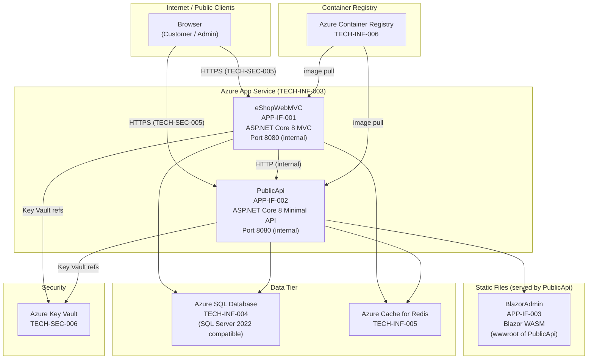
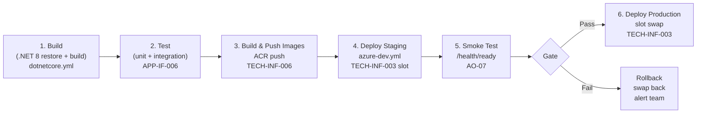

# Deployment Architecture — eShopOnWeb
## Pipeline: Graphify v2.0 | Date: 2026-06-30 | GR-08: RESOLVED (dotnet8)

**Forward Engineering Document 18 of 20**
**Generated:** 2026-06-30
**Pipeline Stage:** Forward Engineering (Layer 6) — Wave 5
**Source Foundation:** ENTERPRISE_KNOWLEDGE_GRAPH.json + ARCHITECTURE_INVENTORY.md + CANONICAL_ENTERPRISE_MODEL.md
**GR-08 Gate:** RESOLVED — target_stack = "dotnet8"
**Confidence Schema:** HIGH = direct code evidence; MEDIUM = structural inference; LOW = convention assumption.

---

## Document Purpose

This document specifies the complete deployment architecture for eShopOnWeb's forward-engineered system (version 2.0). It covers all deployable runtime units (APP-IF-001, APP-IF-002, APP-IF-003), the full container specification, Docker Compose configuration for development, Azure App Service deployment via Azure Developer CLI (TECH-CUR-007), CI/CD pipeline design with GitHub Actions (TECH-CUR-008), secrets management remediation for ARCH-VIOL-004, and health check and observability requirements driven by AO-07 and AO-08.

**Five deployment-blocking action items must be resolved before production deployment:**

| Action Item | Description | Violates |
|---|---|---|
| AO-03 | Externalise JWT secret to Azure Key Vault or environment variable | ARCH-VIOL-004 |
| AO-04 | Remove Task.Delay in StartupBackgroundService | ARCH-VIOL-003 |
| AO-07 | Add /health, /health/ready, /health/live endpoints | ARCH-VIOL-007 |
| AO-08 | Add structured logging (Serilog + Application Insights) | ARCH-VIOL-008 |
| AO-09 | Enforce HTTPS/HSTS in production | ARCH-VIOL-005 |

---

## 18.1 Deployment Overview

### 18.1.1 Architecture Diagram



### 18.1.2 Deployable Runtime Units Summary

The eShopOnWeb system produces **three deployable runtime units** and **two class library projects** that are compiled into those units. The class libraries are not independently deployable.

| Unit | Node ID | Type | Runtime | Deployable |
|---|---|---|---|---|
| eShopWebMVC | APP-IF-001 | ASP.NET Core Razor Pages / MVC | Container / App Service | Yes |
| PublicApi | APP-IF-002 | ASP.NET Core Minimal API | Container / App Service | Yes |
| BlazorAdmin | APP-IF-003 | Blazor WebAssembly SPA | Static files only | No — served from PublicApi |
| ApplicationCore | APP-IF-004 | .NET 8 class library | Compiled into APP-IF-001 and APP-IF-002 | No |
| Infrastructure | APP-IF-005 | .NET 8 class library (EF Core) | Compiled into APP-IF-001 and APP-IF-002 | No |
| IntegrationTests | APP-IF-006 | Test project | CI pipeline only | No |

### 18.1.3 BlazorAdmin Clarification

APP-IF-003 (BlazorAdmin) is a Blazor WebAssembly application. It is **not** a separate deployable process. Its compiled output (HTML, CSS, JS, WASM binaries) is published into the `wwwroot` directory of APP-IF-002 (PublicApi) and served as static files by that process. The browser downloads the WASM bundle from PublicApi's static file middleware, executes it client-side, and calls back to PublicApi's REST endpoints. There is no separate container, port, or App Service plan for APP-IF-003.

---

## 18.2 Deployable Units and Container Specifications

### 18.2.1 Container Specification Table

| Unit | Node ID | Docker Image | Internal Port | Host Port (dev) | Health Check Endpoint | Dependencies |
|---|---|---|---|---|---|---|
| eShopWebMVC | APP-IF-001 | eshop/web:latest | 8080 | 5106 | /health/live | SQL Server, Redis, PublicApi |
| PublicApi | APP-IF-002 | eshop/api:latest | 8080 | 5200 | /health/live | SQL Server, Redis |
| SQL Server | TECH-INF-001 | mcr.microsoft.com/azure-sql-edge:latest | 1433 | 1433 | /health (TCP) | — |
| Redis | TECH-INF-005 | redis:7-alpine | 6379 | 6379 | redis-cli PING | — |

### 18.2.2 eShopWebMVC (APP-IF-001)

- **Role:** Web storefront serving Razor Pages to end customers. Hosts the BlazorAdmin static files via a physical file provider pointed at the published BlazorAdmin output. Handles ASP.NET Core Identity cookie authentication (TECH-SEC-003).
- **Runtime:** .NET 8 (TECH-CUR-002), ASP.NET Core 8.0 (TECH-CUR-001)
- **Incorporated libraries:** ApplicationCore (APP-IF-004), Infrastructure (APP-IF-005)
- **Outbound calls:** SQL Server (EF Core — TECH-CUR-003), Redis (basket cache — TECH-CUR-005), PublicApi (internal HTTP for catalogue reads — APP-IF-002)
- **Security surface:** ASP.NET Core Identity (TECH-SEC-001), cookie auth (TECH-SEC-003), HTTPS/TLS termination (TECH-SEC-005), ASP.NET Core Data Protection (TECH-SEC-007)
- **Action items:** AO-07 (add health checks), AO-08 (structured logging), AO-09 (HTTPS/HSTS enforcement — ARCH-VIOL-005)
- **Dockerfile base image:** `mcr.microsoft.com/dotnet/aspnet:8.0`

### 18.2.3 PublicApi (APP-IF-002)

- **Role:** REST API serving catalogue browsing and basket management. Also serves BlazorAdmin static files from its wwwroot. Issues and validates JWT Bearer tokens (TECH-SEC-002).
- **Runtime:** .NET 8 (TECH-CUR-002), ASP.NET Core 8.0 Minimal API (TECH-CUR-001)
- **Incorporated libraries:** ApplicationCore (APP-IF-004), Infrastructure (APP-IF-005)
- **Outbound calls:** SQL Server (EF Core — TECH-CUR-003), Redis (basket cache — TECH-CUR-005)
- **Security surface:** JWT Bearer (TECH-SEC-002), CORS policy for BlazorAdmin origin (TECH-SEC-004), HTTPS/TLS (TECH-SEC-005)
- **Action items:** AO-03 (externalise JWT secret — ARCH-VIOL-004), AO-04 (remove Task.Delay — ARCH-VIOL-003), AO-07 (health checks), AO-08 (structured logging), AO-09 (HTTPS/HSTS — ARCH-VIOL-005)
- **Dockerfile base image:** `mcr.microsoft.com/dotnet/aspnet:8.0`

### 18.2.4 SQL Server (TECH-INF-001 / TECH-INF-004)

- **Development:** `mcr.microsoft.com/azure-sql-edge:latest` container running locally (TECH-INF-001 / TECH-INF-002)
- **Staging / Production:** Azure SQL Database (TECH-INF-004) — General Purpose tier, Gen5 2 vCores minimum for staging; Business Critical recommended for production
- **Databases:** CatalogDb (catalogue + identity), BasketDb (not applicable — basket is Redis-backed)
- **Migrations:** EF Core migrations (TECH-CUR-003) applied at startup via `Database.MigrateAsync()` in Infrastructure seeding

### 18.2.5 Redis (TECH-CUR-005 / TECH-INF-005)

- **Development:** `redis:7-alpine` container running locally (TECH-INF-002)
- **Staging / Production:** Azure Cache for Redis (TECH-INF-005) — C1 Standard tier minimum (1 GB) for staging; C2 or higher for production
- **Usage:** Basket session cache only. Not used for output caching or distributed session in current architecture.
- **Connection:** StackExchange.Redis, connection string injected via environment variable / Key Vault reference (AO-03)

---

## 18.3 Docker Compose Configuration

### 18.3.1 Complete docker-compose.yml (Development)

```yaml
version: "3.9"

services:

  eshopwebmvc:
    image: eshop/web:latest
    build:
      context: .
      dockerfile: src/Web/Dockerfile
    container_name: eshop-web
    ports:
      - "5106:8080"
    environment:
      - ASPNETCORE_ENVIRONMENT=Development
      - ASPNETCORE_URLS=http://+:8080
      - ConnectionStrings__CatalogConnection=Server=sqlserver;Database=Microsoft.eShopOnWeb.CatalogDb;User Id=sa;Password=${SA_PASSWORD};TrustServerCertificate=True;
      - ConnectionStrings__IdentityConnection=Server=sqlserver;Database=Microsoft.eShopOnWeb.Identity;User Id=sa;Password=${SA_PASSWORD};TrustServerCertificate=True;
      - BaseUrlConfiguration__WebBase=http://localhost:5106/
      - BaseUrlConfiguration__ApiBase=http://eshoppublicapi:8080/
    depends_on:
      sqlserver:
        condition: service_healthy
      redis:
        condition: service_healthy
    healthcheck:
      test: ["CMD", "curl", "-f", "http://localhost:8080/health/live"]
      interval: 30s
      timeout: 10s
      retries: 3
      start_period: 40s
    networks:
      - eshop-net

  eshoppublicapi:
    image: eshop/api:latest
    build:
      context: .
      dockerfile: src/PublicApi/Dockerfile
    container_name: eshop-api
    ports:
      - "5200:8080"
    environment:
      - ASPNETCORE_ENVIRONMENT=Development
      - ASPNETCORE_URLS=http://+:8080
      - ConnectionStrings__CatalogConnection=Server=sqlserver;Database=Microsoft.eShopOnWeb.CatalogDb;User Id=sa;Password=${SA_PASSWORD};TrustServerCertificate=True;
      - ConnectionStrings__IdentityConnection=Server=sqlserver;Database=Microsoft.eShopOnWeb.Identity;User Id=sa;Password=${SA_PASSWORD};TrustServerCertificate=True;
      - ConnectionStrings__RedisConnection=redis:6379
      # NOTE: JWT secret must be externalised before production (AO-03 / ARCH-VIOL-004)
      - JwtSettings__Key=${JWT_SECRET}
      - JwtSettings__Issuer=https://localhost:5200
      - JwtSettings__Audience=eshop
      - JwtSettings__ExpiryMinutes=60
    depends_on:
      sqlserver:
        condition: service_healthy
      redis:
        condition: service_healthy
    healthcheck:
      test: ["CMD", "curl", "-f", "http://localhost:8080/health/live"]
      interval: 30s
      timeout: 10s
      retries: 3
      start_period: 40s
    networks:
      - eshop-net

  sqlserver:
    image: mcr.microsoft.com/azure-sql-edge:latest
    container_name: eshop-sql
    ports:
      - "1433:1433"
    environment:
      - ACCEPT_EULA=Y
      - MSSQL_SA_PASSWORD=${SA_PASSWORD}
      - MSSQL_PID=Developer
    volumes:
      - sqlserver-data:/var/opt/mssql
    healthcheck:
      test: ["CMD", "/opt/mssql-tools/bin/sqlcmd", "-S", "localhost", "-U", "sa", "-P", "${SA_PASSWORD}", "-Q", "SELECT 1"]
      interval: 15s
      timeout: 10s
      retries: 5
      start_period: 30s
    networks:
      - eshop-net

  redis:
    image: redis:7-alpine
    container_name: eshop-redis
    ports:
      - "6379:6379"
    volumes:
      - redis-data:/data
    healthcheck:
      test: ["CMD", "redis-cli", "PING"]
      interval: 10s
      timeout: 5s
      retries: 3
    networks:
      - eshop-net

volumes:
  sqlserver-data:
  redis-data:

networks:
  eshop-net:
    driver: bridge
```

### 18.3.2 Environment Variables Table

| Variable | Service | Purpose | Source (Dev) | Source (Prod) |
|---|---|---|---|---|
| `SA_PASSWORD` | sqlserver, eshopwebmvc, eshoppublicapi | SQL Server SA password | `.env` file | Azure Key Vault (TECH-SEC-006) |
| `JWT_SECRET` | eshoppublicapi | JWT signing key (ARCH-VIOL-004) | `.env` file | Azure Key Vault (AO-03) |
| `ConnectionStrings__CatalogConnection` | eshopwebmvc, eshoppublicapi | EF Core SQL connection | Docker env | App Service config / Key Vault ref |
| `ConnectionStrings__IdentityConnection` | eshopwebmvc | Identity DB connection | Docker env | App Service config / Key Vault ref |
| `ConnectionStrings__RedisConnection` | eshoppublicapi | Redis connection string | Docker env | App Service config / Key Vault ref |
| `JwtSettings__Key` | eshoppublicapi | JWT signing key value | `.env` via `${JWT_SECRET}` | Key Vault reference (AO-03) |
| `JwtSettings__Issuer` | eshoppublicapi | JWT issuer claim | Docker env | App Service config |
| `JwtSettings__Audience` | eshoppublicapi | JWT audience claim | Docker env | App Service config |
| `ASPNETCORE_ENVIRONMENT` | all | ASP.NET Core environment name | Docker env | App Service config |
| `APPLICATIONINSIGHTS_CONNECTION_STRING` | eshopwebmvc, eshoppublicapi | Application Insights telemetry (AO-08) | Not set in dev | App Service config / Key Vault ref |

### 18.3.3 Secrets Handling Note

The development `.env` file (committed to `.gitignore`, never to source control) provides `SA_PASSWORD` and `JWT_SECRET` as local overrides. Docker Compose reads this file automatically when present. In CI, these values are injected from GitHub Actions encrypted secrets. In staging and production, all secrets are stored in Azure Key Vault (TECH-SEC-006) and referenced via App Service Key Vault references (`@Microsoft.KeyVault(SecretUri=...)`). See Section 18.7 for the full secret inventory.

---

## 18.4 Azure Deployment (azd)

### 18.4.1 azure.yaml Structure

The Azure Developer CLI (TECH-CUR-007) `azure.yaml` file defines the project structure and maps services to their Bicep/Terraform infrastructure definitions.

```yaml
# azure.yaml — Azure Developer CLI project definition
# Target stack: dotnet8 (GR-08: RESOLVED)
# Infra provider: bicep

name: eshop-on-web
metadata:
  template: eshop-on-web@2.0.0

infra:
  provider: bicep
  path: infra

services:

  web:
    # APP-IF-001: eShopWebMVC
    project: ./src/Web
    language: dotnet
    host: appservice
    docker:
      path: ./src/Web/Dockerfile
      context: .
    env:
      ASPNETCORE_ENVIRONMENT: ${AZURE_ENV_NAME}

  api:
    # APP-IF-002: PublicApi (also serves APP-IF-003 BlazorAdmin static files)
    project: ./src/PublicApi
    language: dotnet
    host: appservice
    docker:
      path: ./src/PublicApi/Dockerfile
      context: .
    env:
      ASPNETCORE_ENVIRONMENT: ${AZURE_ENV_NAME}

# Note: BlazorAdmin (APP-IF-003) is built as part of the api service.
# Its wwwroot output is included in the PublicApi Docker image.
# No separate azd service entry is required.
```

### 18.4.2 App Service Plan

| Dimension | Staging | Production |
|---|---|---|
| Plan tier | B2 (Basic) | P2v3 (Premium v3) |
| vCores | 2 | 2 |
| RAM | 3.5 GB | 8 GB |
| OS | Linux (TECH-CUR-002) | Linux |
| Auto-scale | Off | On (2–6 instances, CPU > 70%) |
| Deployment slots | staging slot | staging + production slots |
| Node | TECH-INF-003 | TECH-INF-003 |

> The B2 tier is the minimum that supports deployment slots and custom domains. Do not use F1 or B1 for staging as they lack deployment slot support needed for the blue-green release strategy described in Section 18.6.

### 18.4.3 Azure SQL Database Tier

| Dimension | Staging | Production |
|---|---|---|
| Tier | General Purpose | Business Critical |
| vCores | 2 | 4 |
| Storage | 32 GB | 100 GB |
| Backup retention | 7 days | 35 days |
| Zone redundancy | Off | On |
| Read replica | Off | 1 geo-replica recommended |
| Node | TECH-INF-004 | TECH-INF-004 |

### 18.4.4 Azure Cache for Redis Tier

| Dimension | Staging | Production |
|---|---|---|
| Tier | C1 Standard (1 GB) | C2 Standard (6 GB) |
| Persistence | Off | RDB snapshots |
| TLS | Required (TECH-SEC-005) | Required |
| Node | TECH-INF-005 | TECH-INF-005 |

### 18.4.5 Azure Container Registry

- **Tier:** Basic for staging; Standard for production (geo-replication not available on Basic)
- **Node:** TECH-INF-006
- **Image names:** `eshop/web:${IMAGE_TAG}`, `eshop/api:${IMAGE_TAG}`
- **Image tag strategy:** Git SHA short hash (`${GITHUB_SHA:0:8}`) appended to semantic version (e.g., `2.0.0-a1b2c3d4`)
- **Retention policy:** Keep last 10 tags per repository; purge untagged manifests after 7 days

### 18.4.6 Environment Variables and Key Vault References (Azure App Service)

The following App Service application settings are configured per environment. Secrets use the Key Vault reference syntax `@Microsoft.KeyVault(SecretUri=https://<vault>.vault.azure.net/secrets/<name>/)`.

```
# eShopWebMVC (APP-IF-001) App Service settings
ASPNETCORE_ENVIRONMENT                    = Production
ConnectionStrings__CatalogConnection     = @Microsoft.KeyVault(SecretUri=https://eshop-kv.vault.azure.net/secrets/catalog-connection-string/)
ConnectionStrings__IdentityConnection    = @Microsoft.KeyVault(SecretUri=https://eshop-kv.vault.azure.net/secrets/identity-connection-string/)
BaseUrlConfiguration__ApiBase            = https://eshop-api.azurewebsites.net/
APPLICATIONINSIGHTS_CONNECTION_STRING    = @Microsoft.KeyVault(SecretUri=https://eshop-kv.vault.azure.net/secrets/appinsights-connection-string/)

# PublicApi (APP-IF-002) App Service settings
ASPNETCORE_ENVIRONMENT                    = Production
ConnectionStrings__CatalogConnection     = @Microsoft.KeyVault(SecretUri=https://eshop-kv.vault.azure.net/secrets/catalog-connection-string/)
ConnectionStrings__IdentityConnection    = @Microsoft.KeyVault(SecretUri=https://eshop-kv.vault.azure.net/secrets/identity-connection-string/)
ConnectionStrings__RedisConnection       = @Microsoft.KeyVault(SecretUri=https://eshop-kv.vault.azure.net/secrets/redis-connection-string/)
JwtSettings__Key                          = @Microsoft.KeyVault(SecretUri=https://eshop-kv.vault.azure.net/secrets/jwt-signing-key/)
JwtSettings__Issuer                       = https://eshop-api.azurewebsites.net
JwtSettings__Audience                     = eshop
APPLICATIONINSIGHTS_CONNECTION_STRING    = @Microsoft.KeyVault(SecretUri=https://eshop-kv.vault.azure.net/secrets/appinsights-connection-string/)
```

---

## 18.5 Environment Strategy

### 18.5.1 Environment Comparison Table

| Dimension | Development | Staging | Production |
|---|---|---|---|
| Infrastructure | Docker Compose (TECH-INF-002) local | Azure App Service B2 (TECH-INF-003) | Azure App Service P2v3 (TECH-INF-003) |
| Database | SQL Server container (TECH-INF-001) | Azure SQL General Purpose 2 vCore (TECH-INF-004) | Azure SQL Business Critical 4 vCore (TECH-INF-004) |
| Cache | Redis 7 container (TECH-INF-005) | Azure Cache for Redis C1 (TECH-INF-005) | Azure Cache for Redis C2 (TECH-INF-005) |
| Container registry | Local Docker daemon (TECH-INF-001) | Azure Container Registry Basic (TECH-INF-006) | Azure Container Registry Standard (TECH-INF-006) |
| Secrets | .env file (NEVER committed) | Azure Key Vault (TECH-SEC-006) | Azure Key Vault (TECH-SEC-006) |
| JWT secret | .env JWT_SECRET variable | Key Vault secret (AO-03) | Key Vault secret (AO-03) |
| HTTPS/TLS | HTTP only (dev convenience) | App Service managed TLS (TECH-SEC-005) | App Service managed TLS + custom domain (TECH-SEC-005) |
| HSTS | Off (ARCH-VIOL-005) | On — AO-09 must be resolved | On — AO-09 required before go-live |
| Structured logging | Off (ARCH-VIOL-008) | Serilog + Application Insights (AO-08) | Serilog + Application Insights (AO-08) |
| Health checks | Off (ARCH-VIOL-007) | /health, /health/ready, /health/live (AO-07) | /health, /health/ready, /health/live (AO-07) |
| EF Core migrations | Auto-applied at startup | Auto-applied at startup (idempotent) | Migration job runs before slot swap |
| ASPNETCORE_ENVIRONMENT | Development | Staging | Production |
| Feature flags | All on | All on | Controlled via configuration |

### 18.5.2 Environment-Specific Configuration Files

| File | Purpose | Environments |
|---|---|---|
| `appsettings.json` | Base configuration, non-secret defaults | All |
| `appsettings.Development.json` | Dev overrides; `"DetailedErrors": true`; local URLs | Development only |
| `appsettings.Staging.json` | Staging overrides; reduced log verbosity | Staging |
| `appsettings.Production.json` | Production hardening; `"DetailedErrors": false`; HSTS on | Production |
| `.env` | Docker Compose secret injection (gitignored) | Development only |
| `infra/main.bicep` | Azure resource declarations for azd (TECH-CUR-007) | Staging + Production |
| `infra/main.parameters.json` | Per-environment Bicep parameter values | Staging + Production |

---

## 18.6 CI/CD Pipeline Design

### 18.6.1 GitHub Actions Workflow Stages



### 18.6.2 Complete GitHub Actions Workflow

```yaml
# .github/workflows/dotnetcore.yml
# Build, test, and push container images for eShopOnWeb
# Target stack: dotnet8 (GR-08: RESOLVED)

name: Build and Test

on:
  push:
    branches: [main, develop]
  pull_request:
    branches: [main]

env:
  DOTNET_VERSION: "8.0.x"
  REGISTRY: ${{ secrets.AZURE_CONTAINER_REGISTRY }}
  IMAGE_WEB: eshop/web
  IMAGE_API: eshop/api

jobs:

  build-and-test:
    name: Build and Test (.NET 8)
    runs-on: ubuntu-latest
    steps:
      - name: Checkout
        uses: actions/checkout@v4

      - name: Setup .NET ${{ env.DOTNET_VERSION }}
        uses: actions/setup-dotnet@v4
        with:
          dotnet-version: ${{ env.DOTNET_VERSION }}

      - name: Restore dependencies
        run: dotnet restore

      - name: Build solution
        run: dotnet build --no-restore --configuration Release

      - name: Run unit tests
        run: dotnet test --no-build --configuration Release --verbosity normal --filter "Category!=Integration"

      - name: Run integration tests (APP-IF-006)
        run: dotnet test --no-build --configuration Release --verbosity normal --filter "Category=Integration"
        env:
          # Integration tests use TestContainers or localdb; no live Azure resources
          ConnectionStrings__CatalogConnection: ${{ secrets.TEST_CATALOG_CONNECTION }}
          ConnectionStrings__IdentityConnection: ${{ secrets.TEST_IDENTITY_CONNECTION }}

  build-and-push-images:
    name: Build and Push Container Images
    runs-on: ubuntu-latest
    needs: build-and-test
    if: github.ref == 'refs/heads/main'
    outputs:
      image-tag: ${{ steps.tag.outputs.tag }}
    steps:
      - name: Checkout
        uses: actions/checkout@v4

      - name: Compute image tag
        id: tag
        run: echo "tag=2.0.0-${GITHUB_SHA:0:8}" >> "$GITHUB_OUTPUT"

      - name: Log in to Azure Container Registry (TECH-INF-006)
        uses: azure/docker-login@v2
        with:
          login-server: ${{ env.REGISTRY }}
          username: ${{ secrets.ACR_USERNAME }}
          password: ${{ secrets.ACR_PASSWORD }}

      - name: Build and push eShopWebMVC (APP-IF-001)
        run: |
          docker build -f src/Web/Dockerfile -t ${{ env.REGISTRY }}/${{ env.IMAGE_WEB }}:${{ steps.tag.outputs.tag }} .
          docker push ${{ env.REGISTRY }}/${{ env.IMAGE_WEB }}:${{ steps.tag.outputs.tag }}

      - name: Build and push PublicApi (APP-IF-002)
        # BlazorAdmin (APP-IF-003) is built inside this Dockerfile and copied to wwwroot
        run: |
          docker build -f src/PublicApi/Dockerfile -t ${{ env.REGISTRY }}/${{ env.IMAGE_API }}:${{ steps.tag.outputs.tag }} .
          docker push ${{ env.REGISTRY }}/${{ env.IMAGE_API }}:${{ steps.tag.outputs.tag }}

  deploy-staging:
    name: Deploy to Staging (TECH-INF-003)
    runs-on: ubuntu-latest
    needs: build-and-push-images
    environment: staging
    steps:
      - name: Checkout
        uses: actions/checkout@v4

      - name: Setup Azure Developer CLI (TECH-CUR-007)
        uses: azure/setup-azd@v1

      - name: Azure login
        uses: azure/login@v2
        with:
          client-id: ${{ secrets.AZURE_CLIENT_ID }}
          tenant-id: ${{ secrets.AZURE_TENANT_ID }}
          subscription-id: ${{ secrets.AZURE_SUBSCRIPTION_ID }}

      - name: Deploy to staging slot
        run: |
          azd env set AZURE_ENV_NAME staging
          azd deploy --no-prompt
        env:
          AZURE_ENV_NAME: staging
          AZD_INITIAL_ENVIRONMENT_CONFIG: ${{ secrets.AZD_STAGING_ENV }}

  smoke-test-staging:
    name: Smoke Test Staging (AO-07)
    runs-on: ubuntu-latest
    needs: deploy-staging
    steps:
      - name: Wait for App Service to warm up
        run: sleep 30

      - name: Health check — eShopWebMVC (APP-IF-001)
        run: |
          curl --fail --retry 5 --retry-delay 10 \
            https://eshop-web-staging.azurewebsites.net/health/ready

      - name: Health check — PublicApi (APP-IF-002)
        run: |
          curl --fail --retry 5 --retry-delay 10 \
            https://eshop-api-staging.azurewebsites.net/health/ready

      - name: API smoke test — catalogue endpoint
        run: |
          curl --fail https://eshop-api-staging.azurewebsites.net/api/catalog-items \
            -H "Accept: application/json"

  deploy-production:
    name: Deploy to Production via Slot Swap (TECH-INF-003)
    runs-on: ubuntu-latest
    needs: smoke-test-staging
    environment: production
    steps:
      - name: Azure login
        uses: azure/login@v2
        with:
          client-id: ${{ secrets.AZURE_CLIENT_ID }}
          tenant-id: ${{ secrets.AZURE_TENANT_ID }}
          subscription-id: ${{ secrets.AZURE_SUBSCRIPTION_ID }}

      - name: Swap staging slot to production (APP-IF-001)
        run: |
          az webapp deployment slot swap \
            --resource-group ${{ secrets.AZURE_RESOURCE_GROUP }} \
            --name eshop-web \
            --slot staging \
            --target-slot production

      - name: Swap staging slot to production (APP-IF-002)
        run: |
          az webapp deployment slot swap \
            --resource-group ${{ secrets.AZURE_RESOURCE_GROUP }} \
            --name eshop-api \
            --slot staging \
            --target-slot production

      - name: Post-deploy health check
        run: |
          curl --fail --retry 5 --retry-delay 10 \
            https://eshop-web.azurewebsites.net/health/ready
          curl --fail --retry 5 --retry-delay 10 \
            https://eshop-api.azurewebsites.net/health/ready
```

### 18.6.3 dotnetcore.yml Description

- **File:** `.github/workflows/dotnetcore.yml`
- **Triggers:** Push to `main` and `develop`; pull requests targeting `main`
- **Jobs:** `build-and-test` (restore, build, unit tests, integration tests via APP-IF-006)
- **Purpose:** Gates all merges. No merge is permitted to `main` if the build or any test fails.
- **Integration test environment:** Uses environment variables injected from GitHub Actions secrets; integration tests run against a containerised SQL Server (TestContainers) or a dedicated CI SQL instance. APP-IF-006 is the test project node.

### 18.6.4 azure-dev.yml Description

- **File:** `.github/workflows/azure-dev.yml`
- **Triggers:** Successful completion of `build-and-test` job on `main` branch (workflow_run event)
- **Tool:** Azure Developer CLI (TECH-CUR-007) — `azd deploy`
- **Purpose:** Provisions or updates Azure resources (TECH-INF-003, TECH-INF-004, TECH-INF-005, TECH-INF-006) via Bicep, builds and pushes container images to ACR (TECH-INF-006), and deploys to the staging App Service slot.
- **Identity:** Uses OIDC federated credential (no long-lived secrets); configured via `azure/login@v2` with `client-id`, `tenant-id`, `subscription-id`.

### 18.6.5 dependabot.yml Description

- **File:** `.github/dependabot.yml`
- **Purpose:** Automated dependency update pull requests for NuGet packages (TECH-CUR-001, TECH-CUR-002, TECH-CUR-003) and GitHub Actions pinned versions.
- **Schedule:** Weekly on Mondays at 09:00 UTC
- **Target branches:** `develop` (not `main` directly — all updates go through PR review)
- **Grouping:** Group minor and patch NuGet updates into a single PR per week to reduce noise.

### 18.6.6 Branch Strategy

| Branch | Purpose | Deploys to | Gate |
|---|---|---|---|
| `feature/*` | Individual feature development | None | PR review required |
| `develop` | Integration branch | None (build + test only) | All tests pass |
| `main` | Release-ready code | Staging (automatic) then Production (manual approval) | Smoke tests pass; Production environment approval required |

---

## 18.7 Secrets Management

### 18.7.1 Current State — ARCH-VIOL-004

ARCH-VIOL-004 documents that the JWT signing key is hardcoded as a plaintext string in `AuthorizationConstants.cs` (referenced in the existing codebase). This is a critical security violation. The secret is committed to source control, visible to all repository contributors, and cannot be rotated without a code change and redeployment. AO-03 mandates externalising this secret before any staging or production deployment.

### 18.7.2 Target State

All secrets are stored in Azure Key Vault (TECH-SEC-006) and accessed at runtime via:
1. **Azure App Service Key Vault references** — App Service resolves `@Microsoft.KeyVault(SecretUri=...)` application settings at startup. The application code reads `IConfiguration` normally; no Key Vault SDK call is required at the application layer.
2. **Environment variables in CI** — GitHub Actions secrets inject values for the CI pipeline. They are never written to disk or logged.
3. **Managed Identity** — App Service uses a system-assigned managed identity with `Key Vault Secrets User` role. No client secret or certificate is stored on the App Service instance.

### 18.7.3 Secret Inventory Table

| Secret ID | Secret Name | Description | Dev Storage | Staging Storage | Production Storage | Rotation Policy |
|---|---|---|---|---|---|---|
| SEC-001 | `catalog-connection-string` | SQL Server EF Core connection string (APP-IF-001, APP-IF-002) | `.env` | Azure Key Vault (TECH-SEC-006) | Azure Key Vault (TECH-SEC-006) | On DBA password rotation; max 90 days |
| SEC-002 | `identity-connection-string` | Identity DB connection string (APP-IF-001) | `.env` | Azure Key Vault | Azure Key Vault | On DBA password rotation; max 90 days |
| SEC-003 | `redis-connection-string` | Redis connection string incl. access key (APP-IF-002) | `.env` | Azure Key Vault | Azure Key Vault | On Redis key regeneration; max 180 days |
| SEC-004 | `jwt-signing-key` | JWT HMAC-SHA256 signing key (APP-IF-002 — AO-03 / ARCH-VIOL-004) | `.env` | Azure Key Vault | Azure Key Vault | Every 90 days; rolling rotation with 15-min overlap |
| SEC-005 | `appinsights-connection-string` | Application Insights telemetry key (AO-08) | Not used | Azure Key Vault | Azure Key Vault | Annual or on workspace regeneration |
| SEC-006 | `sa-password` | SQL Server SA password for dev/CI containers | `.env` | GitHub Actions secret | Not applicable (Azure SQL uses Entra auth) | On team rotation; max 90 days |
| SEC-007 | `acr-username` / `acr-password` | ACR push credentials for CI image builds (TECH-INF-006) | Not used | GitHub Actions secret | GitHub Actions secret | Replaced by OIDC/managed identity when possible |

### 18.7.4 Key Vault Access Policy

| Principal | Role | Secrets Access |
|---|---|---|
| App Service — eShopWebMVC (APP-IF-001) managed identity | Key Vault Secrets User | SEC-001, SEC-002, SEC-005 |
| App Service — PublicApi (APP-IF-002) managed identity | Key Vault Secrets User | SEC-001, SEC-002, SEC-003, SEC-004, SEC-005 |
| GitHub Actions service principal | Key Vault Secrets User | SEC-007 only (image push) |
| DevOps engineers | Key Vault Administrator | All (break-glass access, audited) |

---

## 18.8 Health Checks and Observability

### 18.8.1 Health Check Endpoints (AO-07 / ARCH-VIOL-007)

ARCH-VIOL-007 documents that no health checks are currently registered in either APP-IF-001 or APP-IF-002. Azure App Service health probes require a responding HTTP endpoint to determine instance health and enable automatic instance replacement. AO-07 requires registering health checks before staging deployment.

**Required endpoints per service:**

| Endpoint | Purpose | Checks |
|---|---|---|
| `GET /health` | Aggregate health (all dependencies) | SQL Server connectivity, Redis PING |
| `GET /health/ready` | Readiness probe (is the app ready to serve traffic?) | SQL Server, Redis, EF Core migrations applied |
| `GET /health/live` | Liveness probe (is the process alive?) | No external dependency check — process heartbeat only |

**Implementation pattern (ASP.NET Core 8.0 — TECH-CUR-001):**

```csharp
// Program.cs — add to both APP-IF-001 and APP-IF-002
builder.Services.AddHealthChecks()
    .AddSqlServer(
        connectionString: builder.Configuration.GetConnectionString("CatalogConnection")!,
        name: "sql-server",
        tags: ["ready", "db"])
    .AddRedis(
        redisConnectionString: builder.Configuration.GetConnectionString("RedisConnection")!,
        name: "redis",
        tags: ["ready", "cache"]);

// Map endpoints
app.MapHealthChecks("/health");
app.MapHealthChecks("/health/ready", new HealthCheckOptions
{
    Predicate = check => check.Tags.Contains("ready")
});
app.MapHealthChecks("/health/live", new HealthCheckOptions
{
    Predicate = _ => false  // liveness: no checks, just 200 OK
});
```

**Azure App Service health probe configuration:**
- Health probe path: `/health/live`
- Interval: 30 seconds
- Unhealthy threshold: 2 consecutive failures trigger instance restart

### 18.8.2 Structured Logging (AO-08 / ARCH-VIOL-008)

ARCH-VIOL-008 documents that neither APP-IF-001 nor APP-IF-002 currently uses structured logging. Console output is unstructured text. Azure Monitor / Application Insights cannot parse unstructured text into queryable fields. AO-08 requires adding Serilog with an Application Insights sink before staging deployment.

**Required Serilog configuration:**

```csharp
// Program.cs — apply to both APP-IF-001 and APP-IF-002
builder.Host.UseSerilog((context, services, config) =>
{
    config
        .ReadFrom.Configuration(context.Configuration)
        .ReadFrom.Services(services)
        .Enrich.FromLogContext()
        .Enrich.WithProperty("Service", context.HostingEnvironment.ApplicationName)
        .Enrich.WithProperty("Environment", context.HostingEnvironment.EnvironmentName)
        .WriteTo.Console(new RenderedCompactJsonFormatter())  // structured JSON to stdout
        .WriteTo.ApplicationInsights(
            services.GetRequiredService<TelemetryConfiguration>(),
            TelemetryConverter.Traces);
});
```

**appsettings.Production.json Serilog section:**

```json
{
  "Serilog": {
    "MinimumLevel": {
      "Default": "Information",
      "Override": {
        "Microsoft": "Warning",
        "Microsoft.EntityFrameworkCore": "Warning",
        "System": "Warning"
      }
    }
  }
}
```

### 18.8.3 Metrics to Collect per Service

| Metric | Unit | Service | Collection Method | Alert Threshold |
|---|---|---|---|---|
| HTTP request duration | ms (p95) | APP-IF-001, APP-IF-002 | Application Insights dependency tracking | > 2000 ms |
| HTTP error rate (5xx) | % | APP-IF-001, APP-IF-002 | Application Insights request telemetry | > 1% over 5 min |
| SQL query duration | ms (p95) | APP-IF-001, APP-IF-002 | Application Insights SQL dependency | > 500 ms |
| Redis cache hit rate | % | APP-IF-002 | Application Insights custom metric | < 80% |
| Health check failures | count | APP-IF-001, APP-IF-002 | Azure Monitor App Service health probe | > 0 consecutive |
| Container CPU usage | % | APP-IF-001, APP-IF-002 | Azure Monitor App Service metrics | > 80% sustained 5 min |
| Container memory usage | % | APP-IF-001, APP-IF-002 | Azure Monitor App Service metrics | > 85% |
| Active connections (SQL) | count | TECH-INF-004 | Azure SQL metrics | > 80% of max |
| DTU / vCore utilization | % | TECH-INF-004 | Azure SQL metrics | > 80% |
| Redis memory usage | % | TECH-INF-005 | Azure Cache for Redis metrics | > 75% |
| Startup Task.Delay removed | boolean gate | APP-IF-002 | Deployment readiness check (AO-04) | Must be 0 before deploy |

---

## 18.9 Deployment Readiness Assessment

### 18.9.1 Readiness Grid

| # | Dimension | Current State | Target State | Status | Blocker |
|---|---|---|---|---|---|
| 1 | Container images | docker-compose.yml defines services; Dockerfiles present | Multi-stage Dockerfiles, images pushed to ACR (TECH-INF-006) | CONDITIONAL | Dockerfiles must be verified for multi-stage build correctness |
| 2 | Health checks | No health check endpoints registered (ARCH-VIOL-007) | /health, /health/ready, /health/live on both APP-IF-001 and APP-IF-002 | BLOCKED | AO-07 must be implemented |
| 3 | Structured logging | Unstructured console output (ARCH-VIOL-008) | Serilog + Application Insights sink on both services | BLOCKED | AO-08 must be implemented |
| 4 | HTTPS / HSTS | No HSTS enforcement (ARCH-VIOL-005) | UseHsts() in production pipeline; HTTPS redirect middleware | BLOCKED | AO-09 must be resolved |
| 5 | JWT secret | Hardcoded in source (ARCH-VIOL-004) | Azure Key Vault reference via App Service config (AO-03) | BLOCKED | AO-03 must be resolved |
| 6 | Startup delay | Task.Delay in StartupBackgroundService (ARCH-VIOL-003) | Removed; startup time meets App Service boot timeout | BLOCKED | AO-04 must be resolved |
| 7 | CI/CD pipeline | dotnetcore.yml (build/test only); azure-dev.yml present | Full pipeline: build → test → push → deploy staging → smoke test → deploy prod | CONDITIONAL | azure-dev.yml and smoke test job must be wired up |
| 8 | Secrets management | .env file for dev; no Key Vault integration | Azure Key Vault references for all secrets (TECH-SEC-006) | BLOCKED | AO-03 (covers SEC-001..SEC-005) |
| 9 | Database migrations | Auto-applied at startup | Idempotent migrations; pre-swap migration job in production | CONDITIONAL | Migration job must run before slot swap in prod |

### 18.9.2 Deployment Blockers Table

| Blocker ID | Source Violation | Description | Affected Units | Resolution Wave | Status |
|---|---|---|---|---|---|
| DEP-BLK-001 | ARCH-VIOL-004 | JWT secret hardcoded in source control | APP-IF-002 | Wave 4 (AO-03) | OPEN |
| DEP-BLK-002 | ARCH-VIOL-007 | No health check endpoints — App Service probes will fail | APP-IF-001, APP-IF-002 | Wave 5 (AO-07) | OPEN |
| DEP-BLK-003 | ARCH-VIOL-008 | No structured logging — Azure Monitor cannot parse telemetry | APP-IF-001, APP-IF-002 | Wave 5 (AO-08) | OPEN |
| DEP-BLK-004 | ARCH-VIOL-005 | No HTTPS/HSTS enforcement — production traffic over HTTP | APP-IF-001, APP-IF-002 | Wave 5 (AO-09) | OPEN |
| DEP-BLK-005 | ARCH-VIOL-003 | Task.Delay in StartupBackgroundService extends cold-start time | APP-IF-002 | Wave 5 (AO-04) | OPEN |

---

## 18.10 Open Deployment Questions

| ID | Question | Category | Impact | Owner Hint |
|---|---|---|---|---|
| DEP-OQ-001 | Should APP-IF-001 and APP-IF-002 share an App Service plan or run on separate plans? A shared plan is cheaper but means one service can starve the other under load. | Infrastructure sizing | Cost vs isolation | Platform architect |
| DEP-OQ-002 | Should BlazorAdmin (APP-IF-003) be moved to Azure Static Web Apps in a future iteration, removing it from the PublicApi (APP-IF-002) container? This would allow independent caching and CDN distribution of the WASM bundle. | Architecture evolution | APP-IF-003 static file serving | Frontend architect |
| DEP-OQ-003 | What is the intended database migration strategy for production? Current approach (migrate at startup) risks failing the rolling deployment if a migration is non-backwards-compatible. A dedicated pre-deployment migration job or a compatibility layer pattern is recommended. | Database operations | Production deployment safety | DBA / backend lead |
| DEP-OQ-004 | Should Redis (TECH-INF-005) be used for distributed output caching of catalogue pages in addition to the basket, or is the basket the only Redis use case? This decision affects the Azure Cache for Redis tier sizing. | Infrastructure sizing | Redis tier cost | Backend architect |
| DEP-OQ-005 | Is Azure App Service the final target, or is Azure Kubernetes Service (AKS) on the roadmap? If AKS is planned within 18 months, the Bicep infrastructure and Dockerfiles should be designed with Kubernetes-compatibility in mind (liveness/readiness probes via Kubernetes annotations rather than App Service health probe config). | Platform strategy | Infra investment | Platform architect |
| DEP-OQ-006 | What is the disaster recovery (DR) requirement for the production database (TECH-INF-004)? If RTO < 1 hour, a Business Critical Azure SQL tier with auto-failover group to a secondary region is required. If RTO < 4 hours, geo-redundant backup restore may be sufficient. | Business continuity | Azure SQL tier and cost | Business stakeholder / DBA |

---

## Document Metadata

| Field | Value |
|---|---|
| Document ID | FE-18 |
| Document Title | Deployment Architecture |
| Forward Engineering Wave | Wave 5 — Cross-cutting (FE-17..FE-20) |
| Pipeline Version | Graphify v2.0 |
| Generated Date | 2026-06-30 |
| GR-08 Gate | RESOLVED — target_stack = "dotnet8" |
| Node IDs Cited | APP-IF-001, APP-IF-002, APP-IF-003, APP-IF-004, APP-IF-005, APP-IF-006, TECH-CUR-001, TECH-CUR-002, TECH-CUR-003, TECH-CUR-004, TECH-CUR-005, TECH-CUR-006, TECH-CUR-007, TECH-CUR-008, TECH-CUR-009, TECH-CUR-010, TECH-CUR-011, TECH-INF-001, TECH-INF-002, TECH-INF-003, TECH-INF-004, TECH-INF-005, TECH-INF-006, TECH-SEC-001, TECH-SEC-002, TECH-SEC-003, TECH-SEC-004, TECH-SEC-005, TECH-SEC-006, TECH-SEC-007 |
| Violations Cited | ARCH-VIOL-003, ARCH-VIOL-004, ARCH-VIOL-005, ARCH-VIOL-007, ARCH-VIOL-008 |
| Action Items Cited | AO-03, AO-04, AO-07, AO-08, AO-09 |
| Deployment Blockers | DEP-BLK-001, DEP-BLK-002, DEP-BLK-003, DEP-BLK-004, DEP-BLK-005 |
| Open Questions | DEP-OQ-001 through DEP-OQ-006 |
| Next Document | FE-19 (Observability and Monitoring Architecture) |
