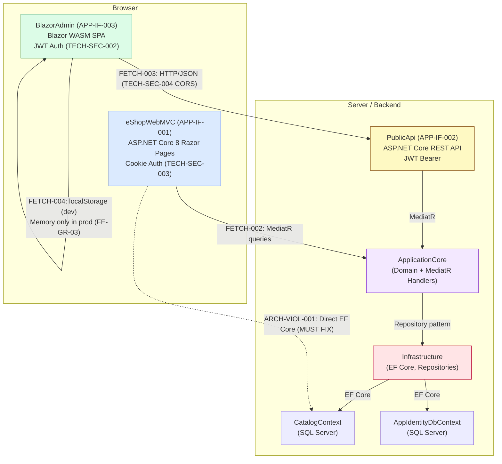
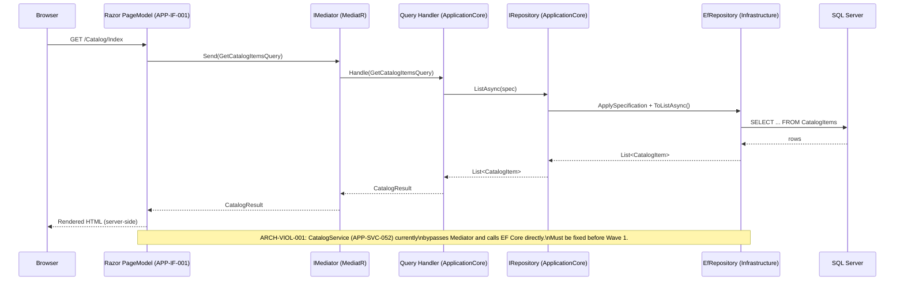
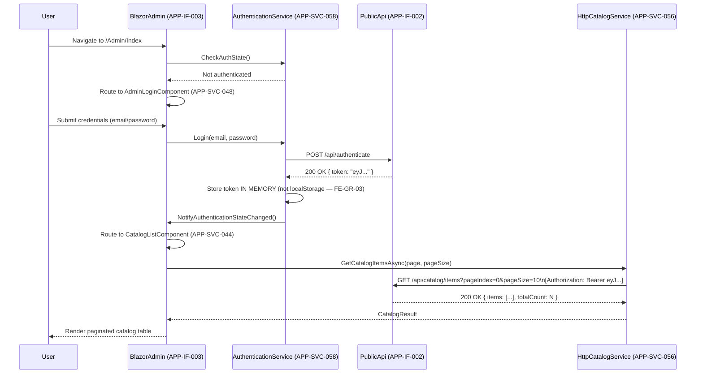
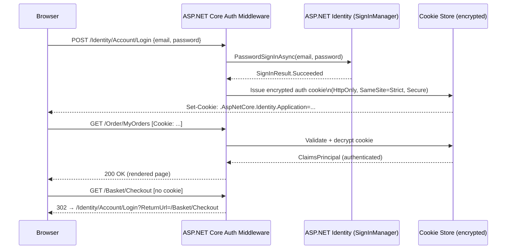

# Frontend Architecture — eShopOnWeb
## Pipeline: Graphify v2.0 | Date: 2026-06-30 | GR-08: RESOLVED (dotnet8)

---

## 19.1 Purpose and Scope

This document specifies the complete frontend architecture for eShopOnWeb, covering both the customer-facing Web storefront (APP-IF-001) and the administrative BlazorAdmin SPA (APP-IF-003). It defines the two frontend surfaces, their technology stacks, page and component inventories, data-fetch patterns, authentication flows, security requirements, architecture violations, and the generation rules that govern forward engineering.

Scope includes:

- All 43 storefront routes served by eShopWebMVC (APP-IF-001)
- All 8 BlazorAdmin components (APP-SVC-044..051)
- All 8 frontend services (APP-SVC-052..059)
- Data-fetch patterns FETCH-001..005
- Security requirements TECH-SEC-002, TECH-SEC-003, TECH-SEC-004
- Architecture violations ARCH-VIOL-001, ARCH-VIOL-004, ARCH-VIOL-009, ARCH-VIOL-011
- Frontend generation rules FE-GR-01..08

Out of scope: backend API design (see 11_API_CONTRACT_SPECIFICATION.md), deployment topology (see 18_DEPLOYMENT_ARCHITECTURE.md), security architecture at infrastructure level (see 13_SECURITY_ARCHITECTURE.md).

**GR-08 Gate Status: RESOLVED — target_stack = dotnet8.** All frontend generation rules assume .NET 8 and the ASP.NET Core 8 / Blazor WebAssembly 8 runtime.

---

## 19.2 Frontend Surface Overview

eShopOnWeb exposes two distinct frontend surfaces. Each surface targets a different actor, uses a different rendering model, and has a different authentication mechanism.

| Surface ID   | Name              | Technology                                | Rendering    | Auth Mechanism          | Primary Actor          | Data Access Pattern          |
|--------------|-------------------|-------------------------------------------|--------------|-------------------------|------------------------|------------------------------|
| APP-IF-001   | eShopWebMVC       | ASP.NET Core 8 Razor Pages                | Server-side  | Cookie (TECH-SEC-003)   | Anonymous + Registered Shopper | MediatR → ApplicationCore (FETCH-002); EF Core direct ARCH-VIOL-001 (must fix) |
| APP-IF-003   | BlazorAdmin       | Blazor WebAssembly SPA                    | Client-side  | JWT Bearer (TECH-SEC-002) | Administrator          | HTTP/JSON → PublicApi (APP-IF-002) via FETCH-003 |

### Architecture Overview Diagram



---

## 19.3 Storefront (Web) — ASP.NET Core Razor Pages

### 19.3.1 Architecture Description

The Web storefront (APP-IF-001, eShopWebMVC) is a server-side rendered ASP.NET Core 8 Razor Pages application. Each page model inherits from `PageModel` and is resolved by the Razor Pages routing engine. Business logic is delegated to ApplicationCore through MediatR queries and commands (FETCH-002, FE-GR-01). User authentication uses ASP.NET Core cookie middleware (TECH-SEC-003).

The application currently contains a critical architecture violation (ARCH-VIOL-001): the `CatalogService` (APP-SVC-052) accesses EF Core `CatalogContext` directly, bypassing ApplicationCore and the repository abstraction. This must be resolved before Wave 1 code generation (see section 19.11).

Static assets (CSS, JS, images) are served directly. Bootstrap 5 is the front-end component framework in use.

### 19.3.2 Page Inventory — All 43 Routes

| # | Route | HTTP Methods | Page Model | Area | Auth Required | Capabilities | Notes |
|---|-------|-------------|------------|------|--------------|-------------|-------|
| 1 | `/` | GET | `CatalogModel` | Catalog | No | BIZ-CAP-001, BIZ-CAP-002, BIZ-CAP-003 | Brand/type filters, pagination |
| 2 | `/Catalog/Index` | GET | `CatalogModel` | Catalog | No | BIZ-CAP-001, BIZ-CAP-002, BIZ-CAP-003 | Alias for `/` |
| 3 | `/Catalog/Error` | GET | — | Catalog | No | — | Error page |
| 4 | `/Basket/Index` | GET, POST | `BasketModel` | Basket | No | BIZ-CAP-010, BIZ-CAP-011, BIZ-CAP-012 | View/update basket; anonymous + authenticated |
| 5 | `/Basket/Checkout` | GET, POST | `CheckoutModel` | Basket | Yes | BIZ-CAP-013, BIZ-CAP-014 | Shipping address; BIZ-RULE-012 enforced |
| 6 | `/Basket/CheckoutComplete` | GET | — | Basket | Yes | BIZ-CAP-016 | Order success/confirmation page |
| 7 | `/Order/MyOrders` | GET | `OrdersModel` | Orders | Yes | BIZ-CAP-017 | Paginated order history |
| 8 | `/Order/Detail/{orderId}` | GET | `OrderDetailModel` | Orders | Yes | BIZ-CAP-018 | Row-level ownership enforced |
| 9 | `/Identity/Account/Login` | GET, POST | `LoginModel` | Identity | No | BIZ-CAP-019 | Lockout handling; anonymous basket merge |
| 10 | `/Identity/Account/Register` | GET, POST | `RegisterModel` | Identity | No | BIZ-CAP-021 | Email confirmation flow |
| 11 | `/Identity/Account/Logout` | GET, POST | `LogoutModel` | Identity | Yes | BIZ-CAP-020 | POST only for logout action |
| 12 | `/Identity/Account/ForgotPassword` | GET, POST | `ForgotPasswordModel` | Identity | No | — | Password reset initiation |
| 13 | `/Identity/Account/ResetPassword` | GET, POST | `ResetPasswordModel` | Identity | No | — | Password reset with token |
| 14 | `/Identity/Account/ConfirmEmail` | GET, POST | `ConfirmEmailModel` | Identity | No | — | Email confirmation |
| 15 | `/Identity/Account/Manage/Index` | GET, POST | `IndexModel` | Identity/Manage | Yes | BIZ-CAP-022 | Profile management |
| 16 | `/Identity/Account/Manage/ChangePassword` | GET, POST | `ChangePasswordModel` | Identity/Manage | Yes | — | Password change |
| 17 | `/Identity/Account/Manage/TwoFactorAuthentication` | GET, POST | `TwoFactorAuthenticationModel` | Identity/Manage | Yes | — | 2FA management hub |
| 18 | `/Identity/Account/Manage/EnableAuthenticator` | GET, POST | `EnableAuthenticatorModel` | Identity/Manage | Yes | — | TOTP setup with QR code |
| 19 | `/Identity/Account/Manage/ExternalLogins` | GET, POST | `ExternalLoginsModel` | Identity/Manage | Yes | — | External provider management |
| 20–43 | `/Identity/Account/Manage/*` (21 sub-pages total) | GET, POST | Various Manage page models | Identity/Manage | Yes | — | Full ASP.NET Identity scaffolded pages (disable authenticator, reset authenticator, generate recovery codes, show recovery codes, set password, personal data, download personal data, delete personal data, email management, phone number, etc.) |
| 44 | `/Admin/Index` | GET | Razor shell | Admin | Yes (admin role) | — | Loads BlazorAdmin WASM bundle (APP-IF-003) |

> Note: Routes 20–43 represent the remaining 21 `/Identity/Account/Manage/*` sub-pages generated by ASP.NET Identity scaffolding. The full set covers: DisableAuthenticator, ResetAuthenticator, GenerateRecoveryCodes, ShowRecoveryCodes, SetPassword, PersonalData, DownloadPersonalData, DeletePersonalData, Email, PhoneNumber, and additional management pages.

### 19.3.3 Data-Fetch Pattern: MediatR → ApplicationCore → Infrastructure

The correct data-fetch pattern for the Web storefront (post ARCH-VIOL-001 resolution) is:

```
PageModel.OnGet() / OnPost()
  → IMediator.Send(Query/Command)
    → QueryHandler in ApplicationCore
      → IRepository<T> (ApplicationCore abstraction)
        → EfRepository<T> in Infrastructure
          → DbContext (EF Core)
            → SQL Server
```

Page models must not instantiate or inject `DbContext` directly. All reads use query objects (e.g., `GetCatalogItemsQuery`, `GetBasketQuery`). All writes use command objects (e.g., `AddItemToBasketCommand`, `CreateOrderCommand`).

### 19.3.4 Authentication: Cookie Auth Flow (TECH-SEC-003)

The Web storefront uses ASP.NET Core cookie authentication configured in `Startup.cs` / `Program.cs`:

- **Scheme**: `Identity.Application` cookie
- **SameSite**: Strict (FE-GR-04)
- **HttpOnly**: true (FE-GR-04)
- **Secure**: true (HTTPS required — AO-09)
- **Expiration**: sliding, 14 days
- **Login path**: `/Identity/Account/Login`
- **Access denied path**: `/Identity/Account/AccessDenied`

On login, the `LoginModel.OnPostAsync()` calls `SignInManager.PasswordSignInAsync()`. On successful authentication, ASP.NET Core issues the encrypted cookie. All subsequent requests carry the cookie; the middleware validates and hydrates `HttpContext.User`.

On logout, a POST to `/Identity/Account/Logout` calls `SignInManager.SignOutAsync()`, which clears the authentication cookie. The basket is cleared at this point.

Anonymous users can browse and add to basket. The basket is tracked via an anonymous claim stored in a separate cookie. On login, the anonymous basket is merged with the authenticated user's basket (BIZ-GR-07, FETCH-005).

### 19.3.5 Current Violation: ARCH-VIOL-001

**ARCH-VIOL-001: Web project (APP-IF-001) directly accesses EF Core CatalogContext via CatalogService (APP-SVC-052).**

- **Severity**: High
- **Impact**: CatalogService (APP-SVC-052) bypasses the repository abstraction and the ApplicationCore domain layer, making the Web project directly dependent on the Infrastructure layer.
- **Fix required before**: Wave 1 code generation
- **Resolution**: Replace direct EF Core calls in APP-SVC-052 with MediatR queries dispatched through `IMediator`. See section 19.11 for full fix instructions.

---

## 19.4 Admin SPA (BlazorAdmin) — Blazor WebAssembly

### 19.4.1 Architecture Description

BlazorAdmin (APP-IF-003) is a Blazor WebAssembly Single Page Application. It is served as static files from the `/Admin/Index` Razor shell page (APP-IF-001). The WASM bundle runs entirely in the browser. All data access goes through HTTP/JSON calls to PublicApi (APP-IF-002) using typed `HttpClient` instances (FETCH-003, FE-GR-02).

Authentication is JWT Bearer (TECH-SEC-002). The `AuthenticationService` (APP-SVC-058) obtains a JWT token from PublicApi's auth endpoint. The token is held in memory only in production (FE-GR-03); it is never written to `localStorage` in a production build (ARCH-VIOL-004 resolution requirement).

Cross-origin requests from BlazorAdmin to PublicApi are permitted by CORS policy (TECH-SEC-004), which allows only the BlazorAdmin origin.

### 19.4.2 Component Inventory (APP-SVC-044..051)

| Node ID      | Component Name                 | Type       | Description                                                                 | Auth Required |
|--------------|--------------------------------|------------|-----------------------------------------------------------------------------|--------------|
| APP-SVC-051  | AppComponent                   | Root       | Root component; hosts router and DI scope                                   | No           |
| APP-SVC-050  | MainLayoutComponent            | Layout     | Shell layout: nav sidebar + main content area                               | No           |
| APP-SVC-049  | NavMenuComponent               | Navigation | Left-side navigation sidebar with admin links                               | Yes          |
| APP-SVC-048  | AdminLoginComponent            | Page       | JWT credentials form; calls AuthenticationService (APP-SVC-058)             | No           |
| APP-SVC-044  | CatalogListComponent           | Page       | Paginated table of catalog items; hosts create/edit/delete action triggers   | Yes          |
| APP-SVC-045  | CreateCatalogItemComponent     | Page/Form  | Form for creating a new catalog item; calls HttpCatalogService POST          | Yes          |
| APP-SVC-046  | EditCatalogItemComponent       | Page/Form  | Edit form pre-populated with existing item data; calls HttpCatalogService PUT | Yes         |
| APP-SVC-047  | DeleteCatalogItemComponent     | Page/Dialog | Confirmation dialog before deletion; calls HttpCatalogService DELETE         | Yes          |

### 19.4.3 Service Inventory (APP-SVC-056..059)

| Node ID      | Service Name                | Type                     | Description                                                                               | Dependencies              |
|--------------|-----------------------------|--------------------------|-------------------------------------------------------------------------------------------|---------------------------|
| APP-SVC-056  | HttpCatalogService          | Typed HttpClient         | HTTP client wrapping PublicApi catalog endpoints (GET, POST, PUT, DELETE /catalog/items)  | APP-IF-002, TECH-SEC-002  |
| APP-SVC-057  | HttpBasketService           | Typed HttpClient         | HTTP client wrapping PublicApi basket endpoints                                            | APP-IF-002, TECH-SEC-002  |
| APP-SVC-058  | AuthenticationService       | Singleton Service        | Acquires and holds JWT token; exposes auth state to components                             | APP-IF-002 auth endpoint  |
| APP-SVC-059  | BasketStateService          | Singleton (In-Memory)    | In-memory basket state; does not persist to localStorage in production (FE-GR-03)          | —                         |

### 19.4.4 Data-Fetch Pattern: HttpCatalogService → PublicApi REST

```
BlazorAdmin Component.OnInitializedAsync()
  → HttpCatalogService (APP-SVC-056)
    → HttpClient (typed, with JWT Bearer header injected by DelegatingHandler)
      → PublicApi (APP-IF-002) REST endpoint
        → MediatR handler in PublicApi
          → ApplicationCore
            → Infrastructure → SQL Server
```

All HTTP calls carry the JWT Bearer token via an `AuthorizationMessageHandler` (or `DelegatingHandler`) registered in the DI container. The token is sourced from `AuthenticationService` (APP-SVC-058).

### 19.4.5 Authentication: JWT Bearer Flow (FE-GR-08)

All data-fetching API calls require a valid JWT token (FE-GR-08). The flow:

1. User lands on BlazorAdmin; `AppComponent` checks `AuthenticationService` for a valid in-memory token.
2. If no valid token, router redirects to `AdminLoginComponent` (APP-SVC-048).
3. User submits credentials; `AuthenticationService` POSTs to PublicApi auth endpoint.
4. PublicApi validates credentials and returns a signed JWT (TECH-SEC-002).
5. `AuthenticationService` stores the token in memory (not localStorage — FE-GR-03).
6. `AuthenticationService` notifies Blazor's `AuthenticationStateProvider`.
7. Components guarded by `[Authorize]` or `<AuthorizeView>` now render.
8. `HttpCatalogService` injects the token into all outbound request headers.

### 19.4.6 State Management: In-Memory

BlazorAdmin uses in-memory state only:

- `BasketStateService` (APP-SVC-059): holds basket state as a C# object graph; not persisted.
- JWT token: held in a private field of `AuthenticationService` (APP-SVC-058); lost on browser refresh (acceptable for admin SPA).
- Component-level state: managed through Blazor's standard component lifecycle (`OnInitializedAsync`, `StateHasChanged`).

No `localStorage` or `sessionStorage` usage is permitted in production builds for sensitive data (FE-GR-03, ARCH-VIOL-004 resolution).

---

## 19.5 Frontend Data-Fetch Patterns

### 19.5.1 Pattern Inventory (FETCH-001..005)

| Pattern ID | Name                          | Used By       | Mechanism                               | Status / Note                                        |
|------------|-------------------------------|---------------|-----------------------------------------|------------------------------------------------------|
| FETCH-001  | EF Core direct                | APP-SVC-052   | `CatalogContext` injected into service  | ARCH-VIOL-001 — must be eliminated before Wave 1     |
| FETCH-002  | MediatR queries               | APP-IF-001    | `IMediator.Send(query)` in PageModel    | Correct pattern; use for all Web storefront reads    |
| FETCH-003  | HTTP/JSON fetch               | APP-IF-003    | Typed `HttpClient` → PublicApi REST     | Correct pattern for BlazorAdmin                      |
| FETCH-004  | Local storage (JWT)           | APP-IF-003    | `localStorage.setItem` (dev only)       | PROHIBITED in production (FE-GR-03, ARCH-VIOL-004)  |
| FETCH-005  | In-memory session cache       | APP-IF-001    | Anonymous basket in memory / cookie     | Correct; basket merged on login (FE-GR-07)           |

### 19.5.2 Web Storefront Data Flow (Sequence Diagram)



### 19.5.3 BlazorAdmin JWT Auth Flow (Sequence Diagram)



---

## 19.6 State Management

### 19.6.1 Web Storefront State (APP-IF-001)

| State | Mechanism | Lifetime | Notes |
|-------|-----------|----------|-------|
| Authenticated user identity | ASP.NET Core cookie (TECH-SEC-003) | Sliding 14 days | HttpOnly, SameSite=Strict, Secure |
| Anonymous basket | In-memory cache keyed by anonymous cookie claim | Until login or expiry | Merged with authenticated basket on login (FE-GR-07, FETCH-005) |
| Authenticated basket | ApplicationCore basket aggregate, persisted to DB | Until checkout or manual clear | Loaded per-request via MediatR (FETCH-002) |
| Pagination state | Query string params (`pageIndex`, `pageSize`, `brandId`, `typeId`) | Per-request | Stateless server-side rendering |
| Antiforgery token | Hidden form field + server-side cookie | Per-request | Required on all POST forms (FE-GR-05) |

### 19.6.2 BlazorAdmin State (APP-IF-003)

| State | Mechanism | Lifetime | Notes |
|-------|-----------|----------|-------|
| JWT auth token | In-memory in AuthenticationService (APP-SVC-058) | Until browser refresh or expiry | NOT localStorage in production (FE-GR-03) |
| Basket state | BasketStateService (APP-SVC-059) singleton | SPA lifetime | In-memory; lost on refresh |
| Catalog list | Component-local state in CatalogListComponent (APP-SVC-044) | Component lifetime | Re-fetched on mount |
| Authentication state | Blazor AuthenticationStateProvider | SPA lifetime | Derives from in-memory JWT |

---

## 19.7 Authentication and Authorization Flows

### 19.7.1 Cookie Auth Flow — Web Storefront (TECH-SEC-003)



- Cookie is encrypted using ASP.NET Core Data Protection.
- `SameSite=Strict` prevents CSRF via cookie transport (FE-GR-04).
- All forms additionally use AntiForgery tokens (FE-GR-05).

### 19.7.2 JWT Bearer Flow — BlazorAdmin (TECH-SEC-002)

See section 19.5.3 for the full sequence diagram.

Key configuration points:

- JWT signing uses a symmetric key stored in configuration (not hardcoded — ARCH-VIOL-004 must be resolved).
- Token claims include: `sub` (user ID), `email`, `role`.
- Token expiration: 60 minutes (recommended); `AuthenticationService` does not auto-refresh in v1.
- All API requests carry `Authorization: Bearer <token>` header injected by `DelegatingHandler`.

### 19.7.3 CORS Configuration (TECH-SEC-004)

PublicApi (APP-IF-002) must allow cross-origin requests from the BlazorAdmin origin only. The CORS policy must be:

```csharp
// PublicApi Program.cs / Startup.cs
builder.Services.AddCors(options =>
{
    options.AddPolicy("BlazorAdminPolicy", policy =>
    {
        policy.WithOrigins("https://<blazoradmin-origin>")   // specific origin only
              .AllowAnyMethod()
              .AllowAnyHeader()
              .AllowCredentials();
    });
});
```

ARCH-VIOL-011 (CORS wildcard in development) must be resolved before Wave 4: no wildcard origin (`*`) is permitted in any deployed environment.

---

## 19.8 Frontend Security Requirements

| Requirement ID | Requirement | Applied To | Implementation | FE Rule |
|----------------|-------------|------------|----------------|---------|
| TECH-SEC-002    | JWT Bearer authentication for PublicApi access | APP-IF-003 | JWT issued by PublicApi auth endpoint; stored in memory only | FE-GR-03, FE-GR-08 |
| TECH-SEC-003    | Cookie authentication for Web storefront | APP-IF-001 | ASP.NET Identity cookie; HttpOnly, SameSite=Strict, Secure | FE-GR-04 |
| TECH-SEC-004    | CORS restricted to BlazorAdmin origin | APP-IF-002 (backend) | `WithOrigins(specific)` policy; no wildcard | — |
| AO-09           | HTTPS enforcement | Both surfaces | `UseHttpsRedirection()` + HSTS headers | — |
| FE-GR-04        | SameSite=Strict + HttpOnly on all auth cookies | APP-IF-001 | Cookie options in `AddAuthentication().AddCookie()` | FE-GR-04 |
| FE-GR-05        | AntiForgery tokens on all forms | APP-IF-001 | `@Html.AntiForgeryToken()` / `asp-antiforgery="true"` on all Razor forms | FE-GR-05 |
| CSP             | Content Security Policy headers on all pages | Both surfaces | Middleware or response headers; restrict script-src, frame-ancestors | — |

---

## 19.9 Frontend Generation Rules (FE-GR-01..08)

| Rule ID   | Rule                                                                              | Rationale                                                      | Affected Components            |
|-----------|-----------------------------------------------------------------------------------|----------------------------------------------------------------|--------------------------------|
| FE-GR-01  | Web Razor Pages use MediatR, not direct EF Core                                   | Resolves ARCH-VIOL-001; enforces layered architecture           | APP-IF-001, APP-SVC-052        |
| FE-GR-02  | BlazorAdmin uses typed HttpClient via HttpCatalogService (APP-SVC-056)            | Encapsulates API contract; enables DI and testability           | APP-IF-003, APP-SVC-056..057   |
| FE-GR-03  | JWT token stored in memory only (not localStorage in production)                  | Prevents XSS-based token theft; resolves ARCH-VIOL-004 vector  | APP-SVC-058, APP-SVC-059       |
| FE-GR-04  | Cookie auth uses SameSite=Strict + HttpOnly                                       | Defense against CSRF and XSS cookie theft                      | APP-IF-001, TECH-SEC-003       |
| FE-GR-05  | All forms use AntiForgery tokens                                                  | CSRF protection supplementary to SameSite                      | All POST forms in APP-IF-001   |
| FE-GR-06  | Pagination implemented on all list pages                                          | Performance; avoids unbounded result sets                      | CatalogModel, OrdersModel, APP-SVC-044 |
| FE-GR-07  | Basket state survives anonymous→authenticated transition                           | BIZ-CAP-011 and business expectation; avoids basket data loss   | APP-SVC-053, BasketModel       |
| FE-GR-08  | BlazorAdmin requires JWT auth for all API calls                                   | All admin actions are authenticated; no anonymous API access   | APP-SVC-044..047, APP-SVC-056..057 |

---

## 19.10 Frontend NFR Targets

These targets are derived from general best practices and the NFR Specification (14_NFR_SPECIFICATION.md). They apply to both frontend surfaces unless noted.

| NFR Category     | Metric                              | Target                              | Surface           | Notes |
|------------------|-------------------------------------|-------------------------------------|-------------------|-------|
| Performance       | First Contentful Paint (FCP)        | < 1.5 s on 4G                       | APP-IF-001        | Server-side rendering advantage |
| Performance       | Time to Interactive (TTI)           | < 3 s on 4G                         | APP-IF-001        | Razor Pages SSR |
| Performance       | BlazorAdmin initial load (WASM)     | < 5 s on broadband                  | APP-IF-003        | WASM bundle size; enable compression |
| Performance       | API response time (P95)             | < 500 ms                            | Both (via API)    | PublicApi SLA |
| Performance       | Catalog page server render time     | < 200 ms                            | APP-IF-001        | Driven by query performance |
| Accessibility     | WCAG compliance                     | WCAG 2.1 AA                         | Both              | All pages (see 20_UI_UX_SPECIFICATION.md) |
| Responsiveness    | Mobile layout functional            | >= 320 px viewport                  | APP-IF-001        | Bootstrap 5 grid |
| Responsiveness    | Tablet layout functional            | >= 768 px viewport                  | APP-IF-001        | Bootstrap 5 grid |
| Availability      | Uptime                              | 99.5% (non-prod); per 18_DEPLOYMENT for prod | Both    | See 18_DEPLOYMENT_ARCHITECTURE.md |
| Security          | HTTPS only                          | All environments                    | Both              | AO-09, HSTS |
| Security          | No sensitive data in client logs    | Zero violations                     | Both              | FE-GR-08 |
| Pagination        | Max page size                       | 100 items                           | Both              | FE-GR-06; enforced server-side |

---

## 19.11 Architecture Violations Affecting Frontend

### ARCH-VIOL-001: Web Directly Accesses EF Core

- **Description**: `CatalogService` (APP-SVC-052) in the Web project injects `CatalogContext` directly, bypassing ApplicationCore repositories.
- **Severity**: High
- **Required before**: Wave 1 code generation
- **Fix**: Refactor `CatalogService` (APP-SVC-052) to dispatch `IMediator.Send(GetCatalogItemsQuery)` and related queries. Remove `CatalogContext` from the Web project's DI registrations. Add MediatR query handlers in ApplicationCore if missing.
- **Validation**: `dotnet build` must produce zero references from `src/Web` to `Microsoft.EntityFrameworkCore` or `Infrastructure.Data` namespaces.

### ARCH-VIOL-004: JWT Secret Hardcoded

- **Description**: The JWT signing secret is hardcoded in `appsettings.json` or source code in the PublicApi project.
- **Severity**: Critical (security)
- **Required before**: Wave 4 code generation
- **Fix**: Move the JWT secret to ASP.NET Core Secret Manager (development), Azure Key Vault or AWS Secrets Manager (production). Reference via `IConfiguration["Auth:JwtSecret"]` from a secrets provider. Ensure the key is never committed to source control.
- **Frontend impact**: `AuthenticationService` (APP-SVC-058) indirectly affected — JWT tokens will continue to work once the signing key is externalized. No client-side code change required.

### ARCH-VIOL-009: No Rate Limiting on PublicApi

- **Description**: PublicApi (APP-IF-002) has no rate limiting, exposing it to abuse from BlazorAdmin or external callers.
- **Severity**: Medium
- **Required before**: Wave 4 code generation
- **Fix**: Add ASP.NET Core rate limiting middleware (`builder.Services.AddRateLimiter(...)`) to PublicApi. Apply fixed-window or sliding-window policy per IP. Return `429 Too Many Requests` with `Retry-After` header.
- **Frontend impact**: `HttpCatalogService` (APP-SVC-056) and `HttpBasketService` (APP-SVC-057) must handle `429` responses gracefully (display user message, implement back-off).

### ARCH-VIOL-011: CORS Wildcard in Development

- **Description**: PublicApi CORS policy uses a wildcard origin (`*`) in development configuration, which can leak to staging/production.
- **Severity**: Medium
- **Required before**: Wave 4 code generation
- **Fix**: Replace wildcard with `policy.WithOrigins(configuration["Cors:AllowedOrigins"])`. Use `appsettings.Development.json` for the development BlazorAdmin origin URL. Never use `*` in `appsettings.Production.json`.
- **Frontend impact**: BlazorAdmin (APP-IF-003) origin URL must be explicitly configured in all environment-specific configuration files.

---

## 19.12 Open Questions and Assumptions

### Open Questions

| ID       | Question                                                                            | Impact                                                    | Blocking |
|----------|-------------------------------------------------------------------------------------|-----------------------------------------------------------|---------|
| OQ-001   | Payment processing: no payment surface found in source                              | Checkout flow is incomplete without payment; Wave 3 blocked | Yes (Wave 3) |
| OQ-009   | Component library for BlazorAdmin: MudBlazor vs Radzen vs Bootstrap?                | Affects component generation for APP-SVC-044..051          | Yes (Wave 2) |

> OQ-001: The current Checkout page (`CheckoutModel`) collects only a shipping address (Address VO-01). No payment fields, payment gateway integration, or payment service references were found in the source analysis. A payment surface decision is required before generating Wave 3 checkout code.

> OQ-009: The BlazorAdmin component library is a human decision. MudBlazor is recommended (see 20_UI_UX_SPECIFICATION.md, ASMP-FE-2002) but must be confirmed before generating component markup for APP-SVC-044..051.

### Assumptions

| ID             | Assumption                                                                        | Consequence if Wrong |
|----------------|-----------------------------------------------------------------------------------|----------------------|
| ASMP-FE-1901   | BlazorAdmin (APP-IF-003) remains Blazor WASM (not migrated to Blazor Server)      | Hosting model and state management would change significantly |
| ASMP-FE-1902   | Web storefront (APP-IF-001) remains ASP.NET Core Razor Pages (not migrated to SPA) | Entire storefront architecture and FETCH-002 pattern would change |
| ASMP-FE-1903   | No i18n (internationalization) required in v1                                     | Resource files and culture middleware would be needed |

---

## 19.13 Traceability Summary

| Node Type        | Count | Representative IDs                                      |
|------------------|-------|---------------------------------------------------------|
| Frontend surfaces | 2    | APP-IF-001, APP-IF-003                                  |
| Backend surfaces  | 1    | APP-IF-002 (PublicApi, consumed by APP-IF-003)          |
| Frontend services | 8    | APP-SVC-052..059                                        |
| Blazor components | 8    | APP-SVC-044..051                                        |
| Storefront routes | 43   | Catalog (3), Basket (3), Orders (2), Identity (35+), Admin (1) |
| Data-fetch patterns | 5  | FETCH-001..005                                          |
| Security requirements | 4 | TECH-SEC-002, TECH-SEC-003, TECH-SEC-004, AO-09        |
| Architecture violations | 4 | ARCH-VIOL-001, ARCH-VIOL-004, ARCH-VIOL-009, ARCH-VIOL-011 |
| Generation rules  | 8    | FE-GR-01..08                                            |
| Open questions    | 2    | OQ-001, OQ-009                                          |
| Assumptions       | 3    | ASMP-FE-1901, ASMP-FE-1902, ASMP-FE-1903               |
| GR-08 gate        | 1    | RESOLVED — target_stack = dotnet8                       |

---

*Generated by Graphify v2.0 | Forward Engineering Pipeline | Document 19 of 20*
*GR-08: RESOLVED (dotnet8) | All generation rules assume .NET 8 runtime*
