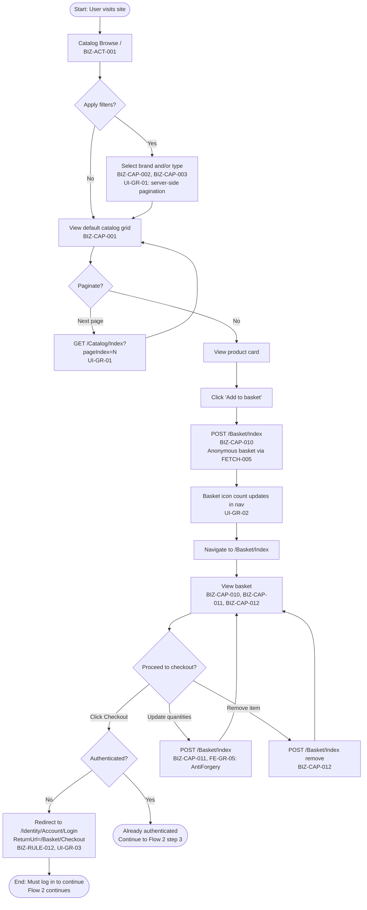
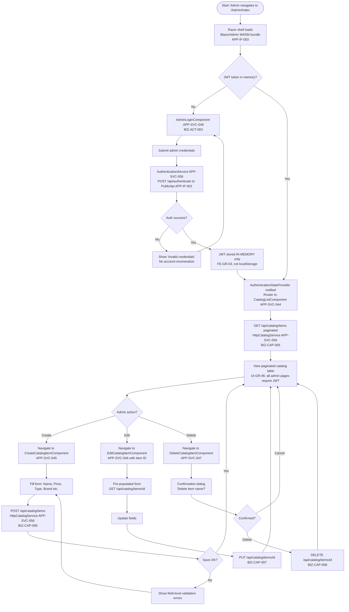

# UI/UX Specification — eShopOnWeb
## Pipeline: Graphify v2.0 | Date: 2026-06-30 | GR-08: RESOLVED (dotnet8)

---

## 20.1 Purpose and Scope

This document is the complete UI/UX specification for eShopOnWeb. It defines every page across both frontend surfaces (Web storefront APP-IF-001 and BlazorAdmin SPA APP-IF-003), the user flows connecting them, validation and error behavior, component library decisions, accessibility requirements, responsive design breakpoints, design system decisions, and the generation rules governing UI code production.

This specification is the authoritative source for front-end code generation and design handoff. It maps every page to the business capabilities (BIZ-CAP-XXX) and business rules (BIZ-RULE-XXX) it exercises, and cross-references the frontend architecture document (19_FRONTEND_ARCHITECTURE.md) for technology decisions.

Scope includes:

- 15 distinct page specifications (11 storefront + 4 admin) covering all 43+ routes
- 4 annotated user flows with Mermaid flowcharts
- Validation and error handling table (HTTP 400 through 500)
- Component library selection and core component lists
- WCAG 2.1 AA accessibility requirements
- Responsive design breakpoints and per-surface behavior
- Design system decisions (all flagged as requiring human confirmation)
- UI generation rules UI-GR-01..10

Out of scope: API contract (see 11_API_CONTRACT_SPECIFICATION.md), security architecture (see 13_SECURITY_ARCHITECTURE.md), deployment (see 18_DEPLOYMENT_ARCHITECTURE.md).

**GR-08 Gate Status: RESOLVED — target_stack = dotnet8.**

---

## 20.2 Actors and Primary Surfaces

### 20.2.1 Actor Definitions

| Actor ID     | Name                  | Description                                                                              | Authentication |
|--------------|-----------------------|------------------------------------------------------------------------------------------|----------------|
| BIZ-ACT-001  | Anonymous Shopper     | Unauthenticated visitor; can browse catalog, add to basket; cannot complete checkout     | None           |
| BIZ-ACT-002  | Registered Shopper    | Authenticated user; full purchase flow including checkout, order history, account management | Cookie auth (TECH-SEC-003) |
| BIZ-ACT-003  | Administrator         | Admin user; manages catalog via BlazorAdmin SPA; no access to storefront admin features  | JWT Bearer (TECH-SEC-002) |
| BIZ-ACT-004  | System                | Automated processes: email notifications (registration confirm, order confirm), health checks | Service-to-service |

### 20.2.2 Surface Ownership Matrix

| Surface          | APP ID       | BIZ-ACT-001 | BIZ-ACT-002 | BIZ-ACT-003 | BIZ-ACT-004 |
|------------------|--------------|:-----------:|:-----------:|:-----------:|:-----------:|
| Web Storefront   | APP-IF-001   | Read (browse/basket) | Full | No access | Email trigger |
| BlazorAdmin SPA  | APP-IF-003   | No access   | No access   | Full        | Health check |
| PublicApi        | APP-IF-002   | No direct   | No direct   | Via WASM    | Via WASM     |

---

## 20.3 Page Inventory and Requirements

### 20.3.1 Catalog Browse (/)

| Attribute         | Value |
|-------------------|-------|
| Route             | `/`, `/Catalog/Index` |
| HTTP Methods      | GET |
| Page Model        | `CatalogModel` |
| Surface           | APP-IF-001 (Web Storefront) |
| Auth Required     | No |
| Actors            | BIZ-ACT-001, BIZ-ACT-002 |
| Capabilities      | BIZ-CAP-001 (browse catalog), BIZ-CAP-002 (filter by brand), BIZ-CAP-003 (filter by type) |

**Required UI Elements:**

- Product grid: displays catalog items as cards. Each card shows: image (placeholder if none — OQ-UI-002), name, price. No stock indicator (DISC-001 — stock fields not present in source; UI-GR-05: stock fields must not be rendered).
- Brand filter: dropdown populated from `CatalogBrand` list; "All" default option.
- Type filter: dropdown populated from `CatalogType` list; "All" default option.
- Pagination controls: previous/next buttons, current page indicator, total page count (UI-GR-01: server-side pagination via `pageIndex`/`pageSize` query params; FE-GR-06).
- "Add to basket" button on each card; updates basket icon count in nav header (UI-GR-02).
- Navigation header: site logo, basket icon with item count, login/account link.

**Validation Rules:** None (read-only page). Invalid filter values treated as "All".

**DISC-001 Warning:** Stock quantity, availability, and inventory fields were not found in the source codebase. No stock-related UI elements (in-stock badge, out-of-stock overlay, stock count) must be generated for this page or any storefront page.

---

### 20.3.2 Catalog Item Detail

| Attribute         | Value |
|-------------------|-------|
| Route             | No explicit route found in source (OQ-UI-001) |
| HTTP Methods      | GET |
| Surface           | APP-IF-001 (Web Storefront) |
| Auth Required     | No |
| Actors            | BIZ-ACT-001, BIZ-ACT-002 |
| Capabilities      | BIZ-CAP-001 |

**Open Question OQ-UI-001:** No catalog item detail page or route was found in the source analysis. A human decision is required: should there be a dedicated `/Catalog/Detail/{id}` page, or should detail be shown in a modal overlay on the catalog browse page? Code generation for this page is blocked pending resolution of OQ-UI-001.

**Required UI Elements (if dedicated page):**

- Large product image (with placeholder — OQ-UI-002).
- Product name, description, price.
- "Add to basket" button.
- No stock indicator (DISC-001, UI-GR-05).
- Breadcrumb: Home > Catalog > {item name}.
- Back to catalog link.

---

### 20.3.3 Basket (/Basket/Index)

| Attribute         | Value |
|-------------------|-------|
| Route             | `/Basket/Index` |
| HTTP Methods      | GET, POST |
| Page Model        | `BasketModel` |
| Surface           | APP-IF-001 (Web Storefront) |
| Auth Required     | No (anonymous basket supported) |
| Actors            | BIZ-ACT-001 (view/update), BIZ-ACT-002 (full) |
| Capabilities      | BIZ-CAP-010 (view basket), BIZ-CAP-011 (update item quantity), BIZ-CAP-012 (remove item), BIZ-CAP-013 (proceed to checkout) |
| Service           | APP-SVC-053 (BasketService) |

**Required UI Elements:**

- Line items table: columns = Product Name, Unit Price, Quantity (editable input), Line Total, Remove action.
- Quantity input: numeric, min=1, max=999 (enforce client-side and server-side).
- Remove button per line item.
- Order summary: subtotal, (no tax/shipping fields unless OQ-001 resolved), total.
- "Proceed to Checkout" button: routes to `/Basket/Checkout`; if BIZ-ACT-001 (anonymous), redirects to login with `ReturnUrl=/Basket/Checkout` (BIZ-RULE-012, UI-GR-03).
- "Continue Shopping" link: returns to catalog.
- Empty basket state: friendly message + link to catalog.
- AntiForgery token on POST form (FE-GR-05, UI-GR-07).

**Validation Rules:**

- Quantity: integer, 1–999. Show field-level error if out of range.
- On 409 (item removed from catalog): show notification "One or more items in your basket are no longer available and have been removed."

---

### 20.3.4 Checkout (/Basket/Checkout)

| Attribute         | Value |
|-------------------|-------|
| Route             | `/Basket/Checkout` |
| HTTP Methods      | GET, POST |
| Page Model        | `CheckoutModel` |
| Surface           | APP-IF-001 (Web Storefront) |
| Auth Required     | Yes (BIZ-RULE-012; UI-GR-03) |
| Actors            | BIZ-ACT-002 |
| Capabilities      | BIZ-CAP-013 (initiate checkout), BIZ-CAP-014 (submit order) |
| Service           | APP-SVC-054 (OrderService), APP-SVC-053 (BasketService) |

**Required UI Elements:**

- Order summary panel: line items (read-only), total.
- Shipping address form fields (Address VO-01):
  - Street (required, max 180 chars)
  - City (required, max 100 chars)
  - State (required, max 60 chars)
  - ZIP/Postal Code (required, max 20 chars)
  - Country (required, max 90 chars)
- Payment fields: NOT PRESENT. No payment surface was found in source (OQ-001). Do not generate payment fields until OQ-001 is resolved.
- "Place Order" submit button.
- AntiForgery token (FE-GR-05, UI-GR-07).
- On submit: POST dispatches order creation; on success, redirect to `/Basket/CheckoutComplete`.

**Validation Rules:**

- All address fields required.
- Field-level validation messages on empty or oversized inputs.
- If basket is empty at checkout, redirect to basket with message.

**Open Question OQ-001:** No payment processing surface was found. The checkout flow is incomplete without a payment step. Code generation for the checkout submission logic and any payment gateway integration is blocked pending resolution of OQ-001.

---

### 20.3.5 Order Success (/Basket/CheckoutComplete)

| Attribute         | Value |
|-------------------|-------|
| Route             | `/Basket/CheckoutComplete` |
| HTTP Methods      | GET |
| Surface           | APP-IF-001 (Web Storefront) |
| Auth Required     | Yes |
| Actors            | BIZ-ACT-002 |
| Capabilities      | BIZ-CAP-016 (order confirmation) |

**Required UI Elements:**

- Success heading: "Order Placed Successfully".
- Order ID / reference number (displayed prominently).
- Summary: confirmation that order has been received.
- Links: "View My Orders" (`/Order/MyOrders`), "Continue Shopping" (`/`).
- No basket item count in nav (basket is cleared after successful checkout).

**Validation Rules:** None (read-only confirmation page). If accessed without a pending order, redirect to catalog.

---

### 20.3.6 Order History (/Order/MyOrders)

| Attribute         | Value |
|-------------------|-------|
| Route             | `/Order/MyOrders` |
| HTTP Methods      | GET |
| Page Model        | `OrdersModel` |
| Surface           | APP-IF-001 (Web Storefront) |
| Auth Required     | Yes |
| Actors            | BIZ-ACT-002 |
| Capabilities      | BIZ-CAP-017 (view order history) |
| Service           | APP-SVC-054 (OrderService) |

**Required UI Elements:**

- Paginated order list table: columns = Order ID, Date Placed, Total, Status, Detail link.
- Pagination controls (FE-GR-06, UI-GR-01): server-side pagination, `pageIndex`/`pageSize` params.
- Empty state: "You have no orders yet."
- Each row links to `/Order/Detail/{orderId}`.

**Validation Rules:** Row-level ownership is enforced server-side (BIZ-RULE-018); only the authenticated user's orders are returned. No UI validation needed; server handles authorization.

---

### 20.3.7 Order Detail (/Order/Detail/{orderId})

| Attribute         | Value |
|-------------------|-------|
| Route             | `/Order/Detail/{orderId}` |
| HTTP Methods      | GET |
| Page Model        | `OrderDetailModel` |
| Surface           | APP-IF-001 (Web Storefront) |
| Auth Required     | Yes |
| Actors            | BIZ-ACT-002 |
| Capabilities      | BIZ-CAP-018 (view order detail) |
| Service           | APP-SVC-054 (OrderService) |

**Required UI Elements:**

- Order header: Order ID, date placed, status.
- Shipping address display (Address VO-01 snapshot): street, city, state, ZIP, country.
- Line items table (read-only snapshot): product name, unit price at time of order, quantity, line total.
- Order total.
- "Back to My Orders" link.

**Security / Authorization:** Row-level ownership is enforced (BIZ-RULE-018, UI-GR-04). If the authenticated user does not own the requested order, return 403 (not 404, to avoid enumeration — engineering decision).

**Validation Rules:** `orderId` route param must be a valid integer/GUID. Invalid or inaccessible orders return 403 page.

---

### 20.3.8 Login (/Identity/Account/Login)

| Attribute         | Value |
|-------------------|-------|
| Route             | `/Identity/Account/Login` |
| HTTP Methods      | GET, POST |
| Page Model        | `LoginModel` |
| Surface           | APP-IF-001 (Web Storefront) |
| Auth Required     | No (redirects to catalog if already authenticated) |
| Actors            | BIZ-ACT-001 → BIZ-ACT-002 (transition) |
| Capabilities      | BIZ-CAP-019 (authenticate user) |
| Service           | APP-SVC-055 (AccountService) |

**Required UI Elements:**

- Email input (type=email, required).
- Password input (type=password, required).
- "Remember me" checkbox.
- Login submit button.
- Link to Register page.
- Link to Forgot Password page.
- External login provider buttons (if providers configured; managed via ExternalLogins page).
- Lockout notice: displayed when `SignInResult.IsLockedOut = true`. Shows lockout duration if available.
- AntiForgery token (FE-GR-05, UI-GR-07).
- ReturnUrl hidden field (preserve navigation intent).

**Behavior on Successful Login:**

- Anonymous basket is merged with authenticated user's basket (FE-GR-07, BIZ-CAP-011).
- Redirect to `ReturnUrl` if set and valid (no open-redirect; validate against known origins); otherwise redirect to `/`.

**Validation Rules:**

- Email: valid email format, required.
- Password: required.
- Display field-level errors for empty inputs.
- Display account lockout message when locked (do not reveal whether email exists — security best practice).

---

### 20.3.9 Register (/Identity/Account/Register)

| Attribute         | Value |
|-------------------|-------|
| Route             | `/Identity/Account/Register` |
| HTTP Methods      | GET, POST |
| Page Model        | `RegisterModel` |
| Surface           | APP-IF-001 (Web Storefront) |
| Auth Required     | No |
| Actors            | BIZ-ACT-001 → BIZ-ACT-002 (new account) |
| Capabilities      | BIZ-CAP-021 (register account) |
| Service           | APP-SVC-055 (AccountService) |

**Required UI Elements:**

- Email input (type=email, required).
- Password input (type=password, required; show complexity requirements).
- Confirm password input (type=password, required).
- Register submit button.
- Link to Login page.
- AntiForgery token (FE-GR-05, UI-GR-07).

**Post-Registration Flow (BIZ-CAP-021):**

- Email confirmation is sent by BIZ-ACT-004 (System).
- User sees "Registration successful; please check your email to confirm your account."
- Account is not fully active until email is confirmed.

**Validation Rules:**

- Email: valid format, required, must be unique (server-side; show "Email already registered" on 409).
- Password: ASP.NET Identity default policy (min 6 chars, requires digit and non-alphanumeric, configurable).
- Confirm password: must match password.
- Field-level error messages for all violations.

---

### 20.3.10 Account Management (/Identity/Account/Manage/*)

| Attribute         | Value |
|-------------------|-------|
| Route             | `/Identity/Account/Manage/*` (21 sub-pages total) |
| HTTP Methods      | GET, POST per sub-page |
| Surface           | APP-IF-001 (Web Storefront) |
| Auth Required     | Yes |
| Actors            | BIZ-ACT-002 |
| Capabilities      | BIZ-CAP-022 (manage account) |
| Service           | APP-SVC-055 (AccountService) |

**Sub-page inventory (all 21 Manage pages):**

| # | Sub-page Route | Description |
|---|----------------|-------------|
| 1 | `/Manage/Index` | Profile: display name, phone; save profile |
| 2 | `/Manage/ChangePassword` | Change password form |
| 3 | `/Manage/SetPassword` | Set password (external-login-only accounts) |
| 4 | `/Manage/TwoFactorAuthentication` | 2FA hub: enable/disable, recovery codes link |
| 5 | `/Manage/EnableAuthenticator` | TOTP setup: QR code + manual entry code; verify code (UI-GR-09) |
| 6 | `/Manage/DisableAuthenticator` | Disable TOTP authenticator with confirmation |
| 7 | `/Manage/ResetAuthenticator` | Reset authenticator key; invalidates existing app |
| 8 | `/Manage/GenerateRecoveryCodes` | Generate new set of recovery codes; display once |
| 9 | `/Manage/ShowRecoveryCodes` | Display recently generated recovery codes |
| 10 | `/Manage/ExternalLogins` | View and manage external OAuth/OIDC providers |
| 11 | `/Manage/Email` | View/change email address; resend confirmation |
| 12 | `/Manage/PhoneNumber` | Add/change phone number |
| 13 | `/Manage/PersonalData` | Download/delete personal data (GDPR) |
| 14 | `/Manage/DownloadPersonalData` | Download personal data as JSON |
| 15 | `/Manage/DeletePersonalData` | Delete account with password confirmation |
| 16–21 | `/Manage/*` (6 additional) | Additional scaffolded ASP.NET Identity pages (LinkLoginCallback, RemoveLogin, SendVerificationEmail, etc.) |

**Common UI Requirements for All Manage Pages:**

- Manage nav sidebar: list of all management sections with active highlight.
- All POST forms include AntiForgery token (FE-GR-05, UI-GR-07).
- Success/error banner on page after POST (PRG pattern).
- Breadcrumb: Account > {section name}.

**UI-GR-09 Requirement (EnableAuthenticator page):**

- QR code image generated server-side from `authenticatorUri`.
- Manual entry code shown below QR code (for users who cannot scan).
- TOTP verification input: 6-digit code.
- Submit button: "Verify".
- On success: show recovery codes once; link to GenerateRecoveryCodes.

---

### 20.3.11 Logout (/Identity/Account/Logout)

| Attribute         | Value |
|-------------------|-------|
| Route             | `/Identity/Account/Logout` |
| HTTP Methods      | POST only (GET redirects to confirm page) |
| Surface           | APP-IF-001 (Web Storefront) |
| Auth Required     | Yes |
| Actors            | BIZ-ACT-002 |
| Capabilities      | BIZ-CAP-020 (log out) |

**Required UI Elements:**

- Confirmation page (GET): "Are you sure you want to log out?" with Logout POST button and AntiForgery token (FE-GR-05, UI-GR-07).
- On POST: signs out (clears auth cookie), clears basket state, redirects to `/`.
- Nav header: logged-out state shown after redirect.

**Validation Rules:** POST only for the actual logout action (CSRF protection). AntiForgery token required.

---

### 20.3.12 Admin Login (AdminLoginComponent)

| Attribute         | Value |
|-------------------|-------|
| Route             | `/Admin/Index` (loads BlazorAdmin; first component = AdminLoginComponent) |
| Component         | APP-SVC-048 (AdminLoginComponent) |
| Surface           | APP-IF-003 (BlazorAdmin SPA) |
| Auth Required     | No (this IS the auth entry point) |
| Actors            | BIZ-ACT-003 |
| Service           | APP-SVC-058 (AuthenticationService) |

**Required UI Elements:**

- Admin branding header (e.g., "eShopOnWeb Administration").
- Email input.
- Password input.
- Login button.
- Error message display: "Invalid credentials" on 401 from PublicApi.
- No "remember me" (FE-GR-03: token in memory only).
- No external login providers (admin only; JWT-based).

**Behavior on Successful Login:**

- `AuthenticationService` (APP-SVC-058) stores JWT in memory.
- Blazor `AuthenticationStateProvider` is notified.
- Router navigates to `CatalogListComponent` (APP-SVC-044).
- All navigation items in `NavMenuComponent` (APP-SVC-049) become visible.

**Validation Rules:**

- Email and password required.
- On 401: display error, do not expose whether email exists.
- On network error: display "Unable to connect to server."

---

### 20.3.13 Admin Catalog Management (CatalogListComponent)

| Attribute         | Value |
|-------------------|-------|
| Route             | `/Admin` (default route in BlazorAdmin router) |
| Component         | APP-SVC-044 (CatalogListComponent) |
| Surface           | APP-IF-003 (BlazorAdmin SPA) |
| Auth Required     | Yes (JWT — FE-GR-08, UI-GR-06) |
| Actors            | BIZ-ACT-003 |
| Capabilities      | BIZ-CAP-005 (list catalog items), BIZ-CAP-006 (create), BIZ-CAP-007 (edit), BIZ-CAP-008 (delete) |
| Service           | APP-SVC-056 (HttpCatalogService) |

**Required UI Elements:**

- Page heading: "Catalog Management".
- "Create New Item" button: navigates to `CreateCatalogItemComponent` (APP-SVC-045).
- Paginated data table (FE-GR-06, UI-GR-01): columns = ID, Name, Price, Type, Brand, Actions.
- Actions per row: Edit (navigates to APP-SVC-046), Delete (navigates to APP-SVC-047).
- Pagination controls: previous/next, page size selector, current page indicator.
- Loading spinner while data is fetching.
- Empty state: "No catalog items found."

**Validation Rules:** All actions require JWT auth (FE-GR-08). On 401 response, redirect to `AdminLoginComponent`.

---

### 20.3.14 Admin Create/Edit Catalog Item

| Attribute         | Value |
|-------------------|-------|
| Component         | APP-SVC-045 (CreateCatalogItemComponent), APP-SVC-046 (EditCatalogItemComponent) |
| Surface           | APP-IF-003 (BlazorAdmin SPA) |
| Auth Required     | Yes (JWT — FE-GR-08, UI-GR-06) |
| Actors            | BIZ-ACT-003 |
| Capabilities      | BIZ-CAP-006 (create), BIZ-CAP-007 (edit) |
| Service           | APP-SVC-056 (HttpCatalogService) |

**Required UI Elements (shared between Create and Edit forms):**

- Form fields:
  - Name (text, required, max 100 chars)
  - Description (text area, optional, max 500 chars)
  - Price (decimal, required, min 0.01)
  - Picture URI (text/URL, optional — OQ-UI-002 image strategy)
  - Catalog Type (dropdown, required; populated from `/api/catalog/types`)
  - Catalog Brand (dropdown, required; populated from `/api/catalog/brands`)
- Save button (label: "Create Item" or "Save Changes").
- Cancel button: returns to `CatalogListComponent`.
- Field-level validation error messages.
- Success toast/notification on save.

**Edit-specific behavior (APP-SVC-046):**

- Form pre-populated with existing item data fetched via `HttpCatalogService.GetItemAsync(id)`.
- Route param: item ID.

**Validation Rules:**

- All required fields must be non-empty.
- Price must be a positive decimal.
- Display server-side validation errors returned in 400/422 responses.

---

### 20.3.15 Admin Delete Confirmation (DeleteCatalogItemComponent)

| Attribute         | Value |
|-------------------|-------|
| Component         | APP-SVC-047 (DeleteCatalogItemComponent) |
| Surface           | APP-IF-003 (BlazorAdmin SPA) |
| Auth Required     | Yes (JWT — FE-GR-08, UI-GR-06) |
| Actors            | BIZ-ACT-003 |
| Capabilities      | BIZ-CAP-008 (delete catalog item) |
| Service           | APP-SVC-056 (HttpCatalogService) |

**Required UI Elements:**

- Confirmation dialog/page:
  - Item name displayed: "Are you sure you want to delete '{item name}'?"
  - "Delete" button (destructive action styling: red/danger).
  - "Cancel" button: returns to `CatalogListComponent` without action.
- On confirm: `HttpCatalogService.DeleteItemAsync(id)` → PublicApi DELETE `/api/catalog/items/{id}`.
- On success: navigate to `CatalogListComponent` with success toast.
- On error (item not found, 404): show error message.

**Validation Rules:** Confirmation requires explicit user action; no accidental delete.

---

## 20.4 User Flows (4 Annotated Flows)

### 20.4.1 Flow 1 — Anonymous Browse to Basket



**Step Annotations:**

1. Landing on `/`: server renders `CatalogModel` via MediatR → ApplicationCore (FETCH-002 post ARCH-VIOL-001 fix).
2. Filter application: query params `brandId`, `typeId` appended; full page reload (SSR).
3. Pagination: `pageIndex` increments; `pageSize` default is 10 (configurable).
4. "Add to basket": POST with AntiForgery token (FE-GR-05). Anonymous basket created in session (FETCH-005).
5. Basket icon update: re-rendered server-side on next GET; or via partial page update.
6. Checkout attempt by anonymous user: `BIZ-RULE-012` enforced in `CheckoutModel.OnGetAsync()`. 302 redirect to login with `ReturnUrl`.

---

### 20.4.2 Flow 2 — Registered Checkout

```mermaid
flowchart TD
    A([Start: User at Login page\nor already authenticated]) --> B{Already logged in?}
    B -->|No| C[/Identity/Account/Login\nBIZ-CAP-019]
    C --> D[Submit email + password\nFE-GR-04: cookie set\nSameSite=Strict HttpOnly]
    D --> E{Login success?}
    E -->|No - lockout| F[Show lockout message\nDo not reveal if email exists]
    F --> C
    E -->|No - invalid| G[Show invalid credentials message]
    G --> C
    E -->|Yes| H[Anonymous basket merged with\nauthenticated basket\nFE-GR-07, BIZ-CAP-011]
    B -->|Yes| H
    H --> I[View basket /Basket/Index\nwith merged items]
    I --> J[Click Checkout]
    J --> K[/Basket/Checkout GET\nBIZ-CAP-013\nOrder summary + address form]
    K --> L[Fill Address VO-01:\nStreet, City, State, ZIP, Country]
    L --> M{Payment fields?}
    M -->|OQ-001: Not present| N[No payment fields — OQ-001 pending]
    N --> O[Click 'Place Order']
    O --> P[POST /Basket/Checkout\nFE-GR-05: AntiForgery\nOrderCreated event EVT-01]
    P --> Q{Validation OK?}
    Q -->|No| R[Show field-level errors\nAddress VO-01 required fields]
    R --> L
    Q -->|Yes| S[/Basket/CheckoutComplete\nBIZ-CAP-016\nOrder ID displayed]
    S --> T[User views /Order/MyOrders\nBIZ-CAP-017]
    T --> U([End])
```

**Step Annotations:**

1. On successful login, `FE-GR-07` triggers anonymous basket merge in `BasketService` (APP-SVC-053).
2. Checkout page (`CheckoutModel`): Address VO-01 fields rendered. No payment fields (OQ-001).
3. POST `/Basket/Checkout`: `OrderService` (APP-SVC-054) creates order via MediatR, fires `EVT-01` (OrderCreated).
4. On success: basket cleared, redirect to `/Basket/CheckoutComplete`.
5. `/Order/MyOrders` (BIZ-CAP-017): paginated list with the new order visible.

---

### 20.4.3 Flow 3 — Admin Catalog Management



**Step Annotations:**

1. BlazorAdmin is loaded as static WASM files; rendered entirely in browser.
2. JWT stored in memory (APP-SVC-058) — not `localStorage` (FE-GR-03, ARCH-VIOL-004 resolution).
3. All HTTP calls from APP-SVC-056 carry `Authorization: Bearer <token>` header (FE-GR-08).
4. CORS policy (TECH-SEC-004) on PublicApi allows BlazorAdmin origin only; no wildcard (ARCH-VIOL-011 fix).
5. Create/Edit/Delete all call PublicApi REST endpoints. Rate limiting applies (ARCH-VIOL-009 fix).

---

### 20.4.4 Flow 4 — Account and 2FA Management

```mermaid
flowchart TD
    A([Start: Authenticated user BIZ-ACT-002]) --> B[Navigate to /Identity/Account/Manage/Index\nBIZ-CAP-022]
    B --> C[Account management sidebar\nAll 21 sub-pages listed]

    C --> D{Action?}
    D -->|Change password| E[/Manage/ChangePassword\nOld + new + confirm password form]
    E --> F{Valid?}
    F -->|No| G[Show field errors]
    G --> E
    F -->|Yes| H[Password updated\nSuccess banner]
    H --> C

    D -->|Enable 2FA| I[/Manage/TwoFactorAuthentication\nHub page]
    I --> J[/Manage/EnableAuthenticator\nUI-GR-09]
    J --> K[Display QR code +\nmanual entry code]
    K --> L[User scans with authenticator app]
    L --> M[Enter 6-digit TOTP code]
    M --> N{TOTP valid?}
    N -->|No| O[Show 'Invalid code' error]
    O --> M
    N -->|Yes| P[2FA enabled\n/Manage/ShowRecoveryCodes\nDisplay codes ONCE]
    P --> C

    D -->|Generate recovery codes| Q[/Manage/GenerateRecoveryCodes]
    Q --> R[Confirm action\nnew codes invalidate old codes]
    R --> S[/Manage/ShowRecoveryCodes\nDisplay new codes ONCE]
    S --> C

    D -->|Manage external logins| T[/Manage/ExternalLogins\nView connected providers]
    T --> U{Action?}
    U -->|Add provider| V[OAuth redirect to external provider]
    V --> W[Callback: link to account\nBIZ-CAP-022]
    W --> T
    U -->|Remove provider| X[Remove external login\ncannot remove if only login method]
    X --> T
```

**Step Annotations:**

1. All Manage pages require authenticated session cookie (TECH-SEC-003).
2. UI-GR-09: 2FA setup page must show both QR code and manual entry code.
3. Recovery codes shown only once after generation (security requirement).
4. AntiForgery tokens on all POST forms (FE-GR-05, UI-GR-07).

---

## 20.5 Validation and Error Behavior

| HTTP Status | Trigger | UI Behavior | User-Facing Message |
|-------------|---------|-------------|---------------------|
| 400 Bad Request | Form validation failure | Remain on current page; show field-level error messages inline below each invalid field | Field-specific: e.g., "Name is required", "Price must be greater than 0" |
| 401 Unauthorized | Not authenticated / JWT expired | Web: 302 redirect to `/Identity/Account/Login?ReturnUrl=...` (UI-GR-03); BlazorAdmin: redirect to `AdminLoginComponent` | "Please log in to continue" |
| 403 Forbidden | Authenticated but insufficient authorization; order row ownership violation (BIZ-RULE-018, UI-GR-04) | Render 403 error page; do not expose resource details | "You do not have permission to access this page" |
| 404 Not Found | Resource does not exist | Web: redirect to catalog; BlazorAdmin: show inline "Not found" message | "The requested item could not be found" |
| 409 Conflict | Basket item no longer available in catalog; duplicate email on register | Web: show notification banner at top of page; do not remove user input | "One or more items in your basket are no longer available and have been removed" / "This email address is already registered" |
| 422 Unprocessable Entity | Business rule violation (e.g., Address VO-01 invalid data) | Show inline error message near the relevant form section | Business-rule-specific message returned from server |
| 429 Too Many Requests | Rate limit exceeded on PublicApi (ARCH-VIOL-009 fix) | BlazorAdmin: show notification with retry indication | "Too many requests. Please wait a moment and try again." |
| 500 Internal Server Error | Unhandled server exception | Render generic error page; log to structured logger (ASP.NET Core `ILogger`); do not expose stack trace (UI-GR-08) | "An unexpected error occurred. Please try again later." |
| Network error | Server unreachable / timeout | BlazorAdmin: show inline connectivity error | "Unable to connect to the server. Please check your connection." |

---

## 20.6 Component Library

### 20.6.1 Web Storefront — Bootstrap 5 (APP-IF-001)

Bootstrap 5 is already present in the source codebase and is confirmed for continued use (ASMP-FE-2001).

**Core components used:**

| Component | Usage |
|-----------|-------|
| `navbar` | Top navigation bar with basket icon and user menu |
| `card` | Catalog item cards in product grid |
| `table` | Order history, basket line items |
| `form-control` / `form-select` | All form inputs, dropdowns |
| `pagination` | Catalog and order list pagination controls |
| `alert` | Success/error banners after POST operations |
| `modal` (optional) | Catalog item detail if modal approach chosen (OQ-UI-001) |
| `badge` | Basket item count in nav |
| `breadcrumb` | Page navigation context |
| `btn` | All action buttons; `.btn-danger` for destructive actions |

### 20.6.2 BlazorAdmin SPA — MudBlazor (APP-IF-003)

MudBlazor is recommended and assumed (ASMP-FE-2002). This is a HUMAN DECISION — must be confirmed before generating component markup for APP-SVC-044..051. Bootstrap 5 is the fallback if MudBlazor is not approved.

**Core MudBlazor components:**

| MudBlazor Component | Usage |
|--------------------|-------|
| `MudDataGrid` / `MudTable` | `CatalogListComponent` (APP-SVC-044) paginated table |
| `MudForm` + `MudTextField` | Create (APP-SVC-045) and Edit (APP-SVC-046) forms |
| `MudSelect` | Type and Brand dropdowns in catalog forms |
| `MudDialog` | `DeleteCatalogItemComponent` (APP-SVC-047) confirmation |
| `MudNavMenu` / `MudNavLink` | `NavMenuComponent` (APP-SVC-049) sidebar |
| `MudLayout` + `MudMainContent` | `MainLayoutComponent` (APP-SVC-050) shell |
| `MudSnackbar` | Success/error notifications after API calls |
| `MudProgressLinear` / `MudProgressCircular` | Loading states during data fetch |
| `MudButton` | All action buttons |
| `MudTextField` (type=password) | `AdminLoginComponent` (APP-SVC-048) |
| `MudPagination` | Pagination controls in catalog list |

---

## 20.7 Accessibility Baseline

**Standard: WCAG 2.1 Level AA (ASMP-FE-2004)**

### 20.7.1 Global Requirements

| Requirement | Standard Ref | Implementation |
|-------------|-------------|----------------|
| Color contrast ratio >= 4.5:1 for normal text | WCAG 1.4.3 | Validated in design system (human decision — section 20.9) |
| Color contrast ratio >= 3:1 for large text | WCAG 1.4.3 | Validated in design system |
| All non-text content has text alternative | WCAG 1.1.1 | `alt` attribute on all ``; icons have `aria-label` |
| Keyboard navigation for all interactive elements | WCAG 2.1.1 | Tab order follows visual order; no keyboard traps |
| Focus visible indicator on all focusable elements | WCAG 2.4.7 | CSS `:focus-visible` styles; do not suppress outline |
| Page has meaningful `<title>` on every page | WCAG 2.4.2 | `<title>` set in `_Layout.cshtml`; dynamic per page |
| Form inputs have associated `<label>` | WCAG 1.3.1 | `asp-for` binding in Razor Pages generates `for`/`id` pairing |
| Error identification: describe errors in text | WCAG 3.3.1 | Field-level error messages (section 20.5) |
| Language of page declared | WCAG 3.1.1 | `<html lang="en">` |
| Skip navigation link | WCAG 2.4.1 | "Skip to main content" link as first focusable element |
| ARIA roles for dynamic content | WCAG 4.1.2 | `role="alert"` on error banners; `aria-live="polite"` on basket count |

### 20.7.2 Per-Component Accessibility Requirements

| Component | Requirement |
|-----------|-------------|
| Catalog grid | Each card's "Add to basket" button: `aria-label="Add {product name} to basket"` |
| Pagination | `<nav aria-label="Catalog pagination">`; current page: `aria-current="page"` |
| Basket quantity input | `<label>` associated; `aria-label="Quantity for {product name}"` |
| Filter dropdowns | `<label>` explicitly associated with `<select>` |
| Forms (all) | All inputs have labels; error messages referenced via `aria-describedby` |
| Admin data table | Column headers with `scope="col"`; row actions have descriptive `aria-label` |
| Confirmation dialogs | `role="dialog"`, `aria-modal="true"`, focus trapped within dialog |
| QR code (2FA setup) | Alt text: "QR code for authenticator app setup"; manual entry code also shown (UI-GR-09) |
| Loading indicators | `role="status"`, `aria-live="polite"`, `aria-label="Loading..."` |

---

## 20.8 Responsive Design

**Standard: Mobile-first responsive layout (ASMP-FE-2005, UI-GR-10)**

### 20.8.1 Breakpoints

| Breakpoint Name | Viewport Width Range | Bootstrap 5 Prefix | Target Device |
|----------------|---------------------|-------------------|---------------|
| Mobile | 320 px – 767 px | `col-` (xs, no prefix) | Phones |
| Tablet | 768 px – 1199 px | `col-md-` | Tablets, small laptops |
| Desktop | 1200 px+ | `col-xl-` | Desktops, large laptops |

### 20.8.2 Per-Surface Responsive Behavior

**Web Storefront (APP-IF-001):**

| Page | Mobile (320–767 px) | Tablet (768–1199 px) | Desktop (1200+ px) |
|------|--------------------|--------------------|-------------------|
| Catalog Browse | Single column grid; filters collapsed into accordion/offcanvas | 2-column grid; filters in sidebar | 3–4 column grid; filters persistent in left sidebar |
| Basket | Stacked layout; quantity/remove on separate line | Table layout | Full table with all columns visible |
| Checkout | Single-column form | Two-column (address + summary) | Two-column |
| Order History | Card-based list; table columns hidden on small viewports | Table with all columns | Full table |
| Order Detail | Stacked sections | Two-panel layout | Two-panel layout |
| Account Management | Full-width form; nav sidebar hidden behind hamburger | Sidebar + content | Sidebar + content |
| Navigation | Hamburger menu; basket icon visible at all sizes | Expanded nav | Expanded nav |

**BlazorAdmin SPA (APP-IF-003):**

BlazorAdmin is primarily used on desktop. However, basic tablet-responsive layout is required.

| Component | Mobile/Tablet | Desktop |
|-----------|--------------|---------|
| NavMenuComponent (APP-SVC-049) | Collapsed; hamburger toggle | Expanded sidebar |
| CatalogListComponent (APP-SVC-044) | Horizontally scrollable table | Full table |
| Create/Edit forms | Full-width single column | Two-column or centered max-width |
| Delete confirmation dialog | Full-width modal | Centered dialog |

---

## 20.9 Design System Decisions (HUMAN DECISIONS)

All items in this section require explicit human confirmation before code generation. These are flagged as HUMAN DECISION because no design tokens or brand assets were present in the source codebase.

| Decision | Current Status | Recommendation | Blocking |
|----------|---------------|----------------|---------|
| Primary brand color | HUMAN DECISION | Define hex value; must pass WCAG 4.5:1 contrast on white | Yes (CSS generation) |
| Secondary / accent color | HUMAN DECISION | Define hex value | Yes (CSS generation) |
| Error / danger color | HUMAN DECISION | Bootstrap default `#dc3545` or custom | Yes (CSS generation) |
| Success color | HUMAN DECISION | Bootstrap default `#198754` or custom | Yes (CSS generation) |
| Typography: body font | HUMAN DECISION | System font stack or Google Fonts (e.g., Inter) | Yes (layout generation) |
| Typography: heading font | HUMAN DECISION | Same as body or distinct display font | Yes (layout generation) |
| Base font size | HUMAN DECISION | 16 px recommended (WCAG) | Yes |
| Spacing scale | HUMAN DECISION | Bootstrap 5 default spacing scale (0.25 rem increments) recommended | Yes (component generation) |
| Border radius | HUMAN DECISION | 0 (flat), 4 px (slight), or 8 px (rounded) | No (cosmetic) |
| Logo / brand assets | HUMAN DECISION | Provide SVG logo; fallback to text | No (cosmetic) |
| Product image placeholder | HUMAN DECISION (OQ-UI-002) | Generic image icon or branded placeholder; must work without CDN | Yes (catalog page) |
| Dark mode support | HUMAN DECISION | Bootstrap 5 supports `data-bs-theme="dark"`; out of scope for v1 unless required | No |
| Icon library | HUMAN DECISION | Bootstrap Icons (already available with Bootstrap 5) recommended | Yes (nav/action icons) |

---

## 20.10 Internationalization

**Decision: No i18n in v1 (ASMP-FE-2003)**

Internationalization (i18n) and localization (l10n) are explicitly out of scope for version 1 of eShopOnWeb. The following implications apply:

- All UI strings are in English only.
- No `IStringLocalizer` injection, `resx` resource files, or culture middleware are generated.
- No RTL (right-to-left) layout considerations.
- Currency is displayed in a single format (USD or as configured; human decision on currency symbol — see section 20.9).
- Date/time formats use the application's default culture (`en-US`).
- The `<html lang="en">` declaration satisfies WCAG 3.1.1 for v1.

**Future i18n Note:** If i18n is required in a future version, the generated code must be refactored to extract all string literals to `resx` resource files and inject `IStringLocalizer<T>` into page models and Razor views. Blazor components will require `IStringLocalizer` or a client-side i18n library.

---

## 20.11 UI Generation Rules (UI-GR-01..10)

| Rule ID  | Rule | Rationale | Affected Pages / Components |
|----------|------|-----------|----------------------------|
| UI-GR-01 | Catalog browse uses server-side pagination via `pageIndex` and `pageSize` query params | Avoids loading all items; consistent with FE-GR-06 | Catalog Browse (/), Order History (/Order/MyOrders), CatalogListComponent (APP-SVC-044) |
| UI-GR-02 | Basket item count shown in navigation header at all times | Persistent basket awareness; key e-commerce UX pattern | All storefront pages; `_Layout.cshtml` |
| UI-GR-03 | Checkout blocked for anonymous users — redirect to login with `ReturnUrl=/Basket/Checkout` | BIZ-RULE-012 enforcement; preserves intent | CheckoutModel, BasketModel, login redirect logic |
| UI-GR-04 | Order detail page enforces row-level ownership (BIZ-RULE-018); unauthorized access returns 403 | Security; prevents order enumeration | OrderDetailModel (/Order/Detail/{orderId}) |
| UI-GR-05 | No stock fields rendered anywhere in the UI | DISC-001: stock fields not present in source; rendering them would be fabricated data | All catalog-facing pages; CatalogListComponent (APP-SVC-044) |
| UI-GR-06 | BlazorAdmin SPA renders protected pages only after JWT authentication confirmed | FE-GR-08; no admin data exposed pre-auth | All BlazorAdmin pages except AdminLoginComponent (APP-SVC-048) |
| UI-GR-07 | All forms include AntiForgery / CSRF tokens | FE-GR-05; CSRF protection on all state-changing operations | All POST forms in APP-IF-001; Blazor forms in APP-IF-003 |
| UI-GR-08 | Error pages do not leak stack traces or internal error details | Security; prevents information disclosure to attackers | All error pages; 500 handler in `_Layout.cshtml` / middleware |
| UI-GR-09 | 2FA setup page shows both QR code and manual entry code | Accessibility; users without camera must be able to set up TOTP | /Manage/EnableAuthenticator |
| UI-GR-10 | Mobile-first responsive layout using Bootstrap 5 breakpoints | ASMP-FE-2005; required for all viewport sizes | All pages in APP-IF-001; primary layout in APP-IF-003 |

---

## 20.12 Assumptions and Open Questions

### Assumptions

| ID             | Assumption | Consequence if Wrong |
|----------------|------------|----------------------|
| ASMP-FE-2001   | Bootstrap 5 is used for Web storefront (APP-IF-001) | If different CSS framework chosen, all generated component HTML/class names change |
| ASMP-FE-2002   | MudBlazor is used for BlazorAdmin components (APP-IF-003) | If Bootstrap or Radzen chosen, all BlazorAdmin component markup changes; component API differs significantly |
| ASMP-FE-2003   | No i18n required in v1 | All strings must be extracted and resource files added; culture middleware required |
| ASMP-FE-2004   | WCAG 2.1 AA accessibility standard applies | Reduced standard would remove some constraints; higher standard (AAA) would add significant effort |
| ASMP-FE-2005   | Mobile-first responsive layout required | Non-responsive or desktop-only layout would remove breakpoint requirements |

### Open Questions

| ID        | Question | Impact | Who Decides | Blocking |
|-----------|----------|--------|-------------|---------|
| OQ-UI-001 | Catalog item detail: dedicated `/Catalog/Detail/{id}` page or modal overlay on browse page? | Route generation, page model, navigation flow; affects Flow 1 significantly | Product owner / UX designer | Yes — blocks catalog detail page generation |
| OQ-UI-002 | Product image strategy: local files in `wwwroot`, CDN, or placeholder service? | `` generation; no images found in source | DevOps / product owner | Yes — blocks product card generation |
| OQ-001    | Payment processing: no payment surface found in source; what gateway/flow is required? | Checkout form (20.3.4) is incomplete; Wave 3 code generation blocked | Business / product owner | Yes — blocks checkout completion |

---

## 20.13 Traceability Summary

| Node Type | Count | Representative IDs |
|-----------|-------|--------------------|
| Actors | 4 | BIZ-ACT-001, BIZ-ACT-002, BIZ-ACT-003, BIZ-ACT-004 |
| Pages specified | 15 | 20.3.1 through 20.3.15 |
| Storefront routes covered | 43+ | All Catalog, Basket, Orders, Identity, Admin routes |
| BlazorAdmin components | 8 | APP-SVC-044..051 |
| Frontend services | 8 | APP-SVC-052..059 |
| User flows | 4 | Browse→Basket, Checkout, Admin CRUD, Account/2FA |
| Business capabilities cited | 22+ | BIZ-CAP-001..022 |
| Business rules cited | 3 | BIZ-RULE-012, BIZ-RULE-018, BIZ-RULE-021 |
| Architecture violations cited | 3 | ARCH-VIOL-001, ARCH-VIOL-004, ARCH-VIOL-009, ARCH-VIOL-011 |
| UI generation rules | 10 | UI-GR-01..10 |
| Security requirements cited | 4 | TECH-SEC-002, TECH-SEC-003, TECH-SEC-004, AO-09 |
| Frontend generation rules cited | 8 | FE-GR-01..08 |
| Open questions | 3 | OQ-UI-001, OQ-UI-002, OQ-001 |
| Assumptions | 5 | ASMP-FE-2001..2005 |
| Discoveries cited | 1 | DISC-001 (no stock fields) |
| GR-08 gate | 1 | RESOLVED — target_stack = dotnet8 |

---

*Generated by Graphify v2.0 | Forward Engineering Pipeline | Document 20 of 20*
*GR-08: RESOLVED (dotnet8) | Final document in the forward engineering series*
